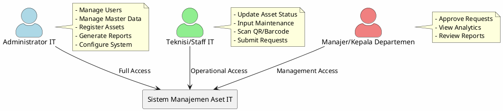
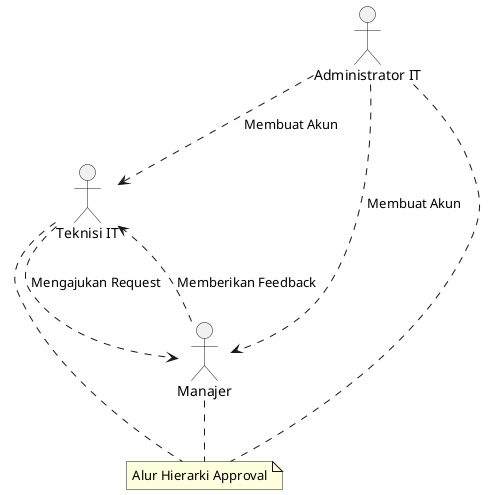

# Identifikasi Aktor Sistem

## 📋 Daftar Aktor

Sistem Monitoring dan Manajemen Inventaris Aset IT memiliki **3 (tiga) aktor utama** yang berinteraksi dengan sistem sesuai dengan peran dan tanggung jawab masing-masing.

---

## 1. Administrator IT

### Deskripsi

Administrator IT adalah pengguna dengan tingkat akses tertinggi dalam sistem. Bertanggung jawab atas pengelolaan seluruh konfigurasi sistem, manajemen pengguna, dan pengelolaan master data aset.

### Karakteristik

- **Tingkat Akses**: Full Access (Level 1)
- **Departemen**: IT Department
- **Jumlah Pengguna Tipikal**: 1-3 orang per organisasi

### Tanggung Jawab

| No  | Tanggung Jawab       | Deskripsi                                                             |
| --- | -------------------- | --------------------------------------------------------------------- |
| 1   | Manajemen Pengguna   | Membuat, mengubah, menghapus akun pengguna sistem                     |
| 2   | Konfigurasi Sistem   | Mengatur parameter sistem seperti jadwal notifikasi, format kode aset |
| 3   | Master Data Kategori | Mengelola kategori dan jenis aset (Laptop, Server, Router, dll)       |
| 4   | Master Data Lokasi   | Mengelola data lokasi penempatan aset                                 |
| 5   | Registrasi Aset      | Memasukkan data perangkat baru lengkap dengan spesifikasi             |
| 6   | Generate Laporan     | Membuat laporan komprehensif untuk manajemen                          |
| 7   | Backup & Restore     | Melakukan backup dan restore data sistem                              |

### Use Cases

- `UC-01` Manage Users
- `UC-02` Manage Asset Categories
- `UC-03` Manage Locations
- `UC-04` Register New Asset
- `UC-05` Generate Reports
- `UC-06` Configure System Settings
- `UC-07` View Dashboard
- `UC-08` Assign Asset to Location/User

---

## 2. Teknisi/Staff IT

### Deskripsi

Teknisi IT adalah pengguna operasional yang bertugas melakukan pemantauan langsung kondisi aset di lapangan. Bertanggung jawab atas update status kondisi aset, pencatatan maintenance, dan verifikasi fisik aset.

### Karakteristik

- **Tingkat Akses**: Operational Access (Level 2)
- **Departemen**: IT Support/Technical Team
- **Jumlah Pengguna Tipikal**: 3-10 orang per organisasi

### Tanggung Jawab

| No  | Tanggung Jawab        | Deskripsi                                             |
| --- | --------------------- | ----------------------------------------------------- |
| 1   | Update Status Aset    | Memperbarui kondisi aset (Normal, Repair, Broken)     |
| 2   | Input Maintenance Log | Mencatat riwayat pemeliharaan dan perbaikan           |
| 3   | Verifikasi Aset       | Melakukan cek fisik aset di lapangan                  |
| 4   | Scan QR/Barcode       | Menggunakan fitur scan untuk identifikasi aset        |
| 5   | Pengajuan Penggantian | Mengajukan request penghapusan/penggantian aset rusak |
| 6   | Dokumentasi Kerusakan | Mencatat dan mendokumentasikan kerusakan aset         |

### Use Cases

- `UC-09` Update Asset Status
- `UC-10` Input Maintenance Log
- `UC-11` View Asset Details
- `UC-12` Scan Asset QR/Barcode
- `UC-13` Submit Replacement Request
- `UC-14` View Maintenance Schedule
- `UC-15` Document Asset Issues

---

## 3. Manajer/Kepala Departemen

### Deskripsi

Manajer adalah pengguna dengan wewenang pengambilan keputusan terkait pengadaan dan penghapusan aset. Bertanggung jawab atas approval workflow dan pemantauan dashboard analytics untuk keperluan strategis.

### Karakteristik

- **Tingkat Akses**: Management Access (Level 3)
- **Departemen**: Management/Department Head
- **Jumlah Pengguna Tipikal**: 2-5 orang per organisasi

### Tanggung Jawab

| No  | Tanggung Jawab       | Deskripsi                                      |
| --- | -------------------- | ---------------------------------------------- |
| 1   | Approval Pengadaan   | Menyetujui atau menolak pengajuan aset baru    |
| 2   | Approval Penghapusan | Menyetujui atau menolak penghapusan aset rusak |
| 3   | View Analytics       | Melihat dashboard analytics dan ringkasan aset |
| 4   | Review Laporan       | Meninjau laporan kondisi aset departemen       |
| 5   | Budget Monitoring    | Memantau anggaran terkait pemeliharaan aset    |

### Use Cases

- `UC-16` Approve Procurement Request
- `UC-17` Approve Disposal Request
- `UC-18` View Analytics Dashboard
- `UC-19` View Summary Reports
- `UC-20` Review Pending Requests

---

## Matriks Hak Akses

| Fitur               | Admin IT | Teknisi | Manajer |
| ------------------- | :------: | :-----: | :-----: |
| Login/Logout        |    ✅    |   ✅    |   ✅    |
| View Dashboard      |    ✅    |   ✅    |   ✅    |
| Manage Users        |    ✅    |   ❌    |   ❌    |
| Manage Categories   |    ✅    |   ❌    |   ❌    |
| Register Asset      |    ✅    |   ❌    |   ❌    |
| Update Asset Status |    ✅    |   ✅    |   ❌    |
| Input Maintenance   |    ✅    |   ✅    |   ❌    |
| Scan QR/Barcode     |    ✅    |   ✅    |   ❌    |
| Submit Request      |    ❌    |   ✅    |   ❌    |
| Approve Request     |    ❌    |   ❌    |   ✅    |
| View Analytics      |    ✅    |   ❌    |   ✅    |
| Generate Reports    |    ✅    |   ❌    |   ✅    |
| Configure System    |    ✅    |   ❌    |   ❌    |

---

## Diagram Aktor

---

## Hubungan Antar Aktor

