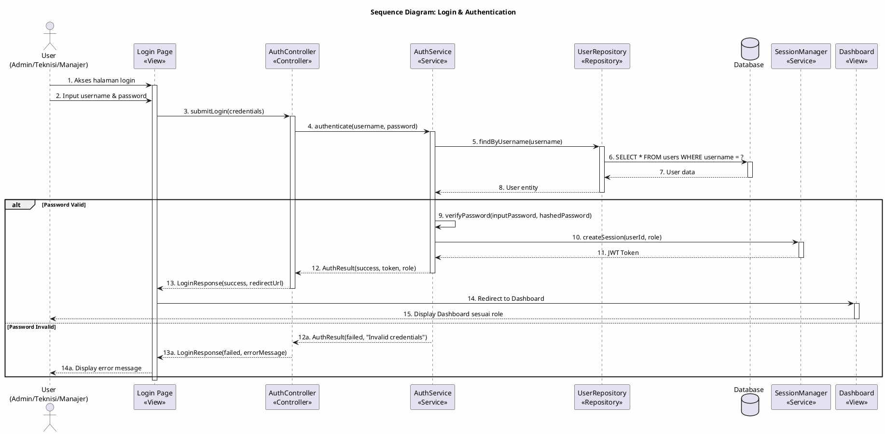
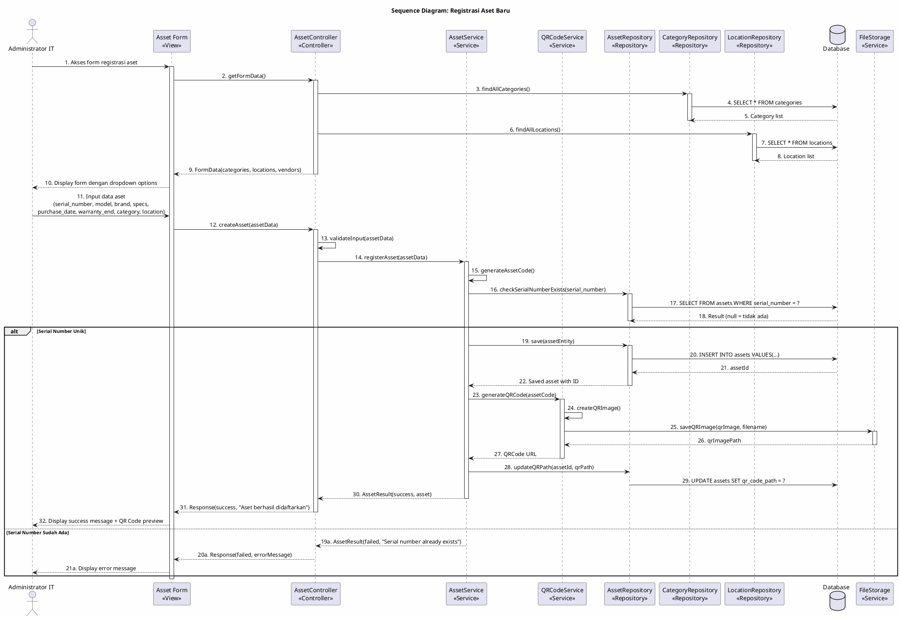
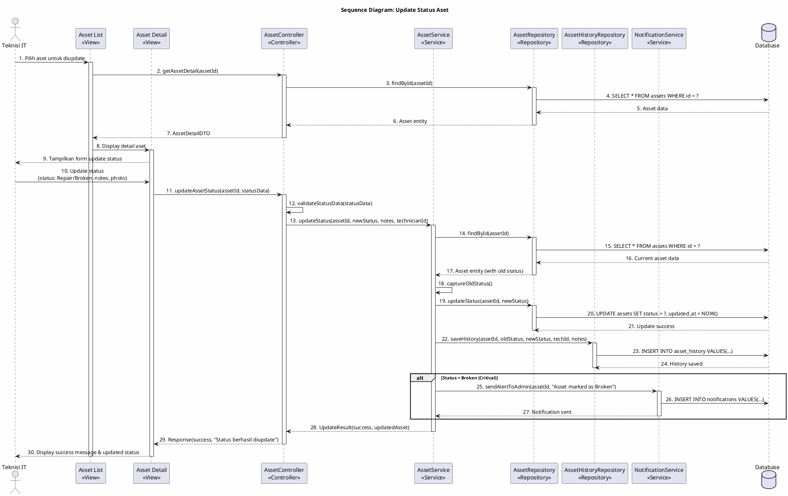
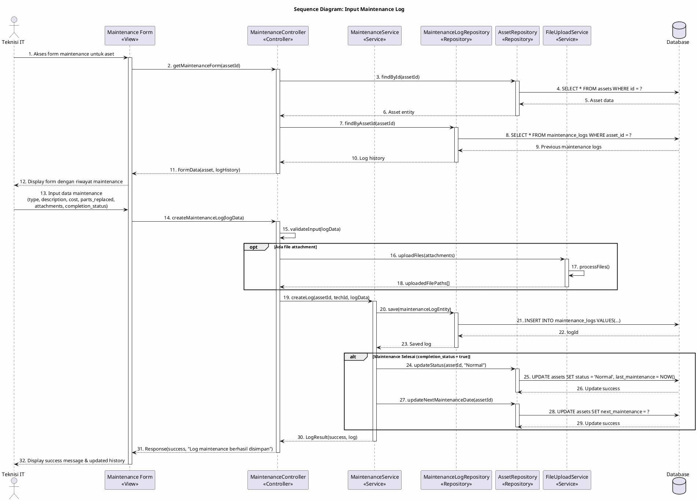
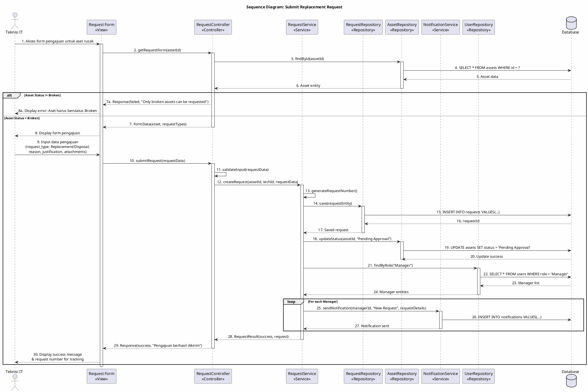
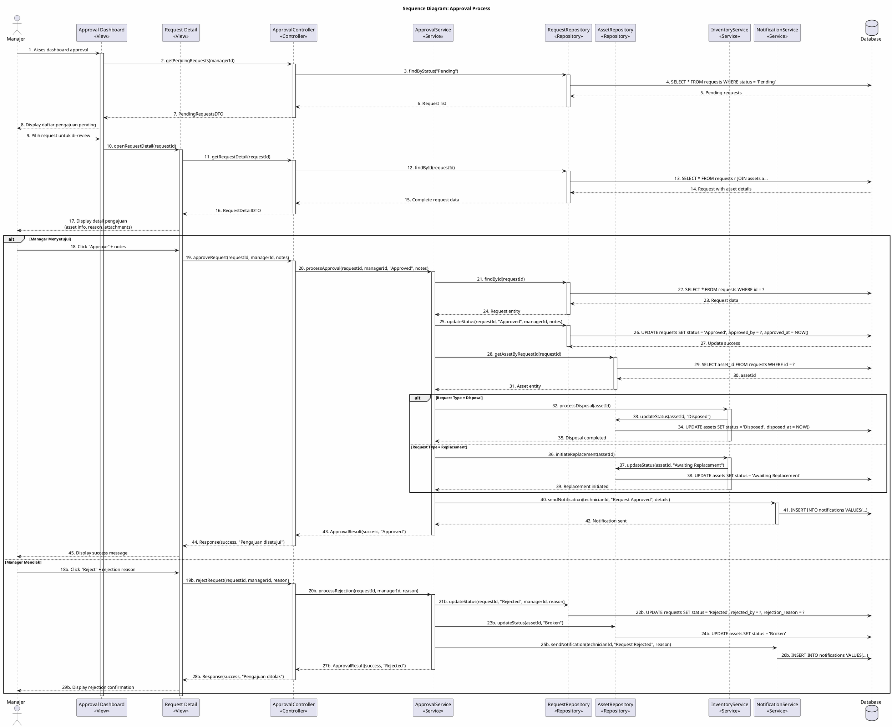
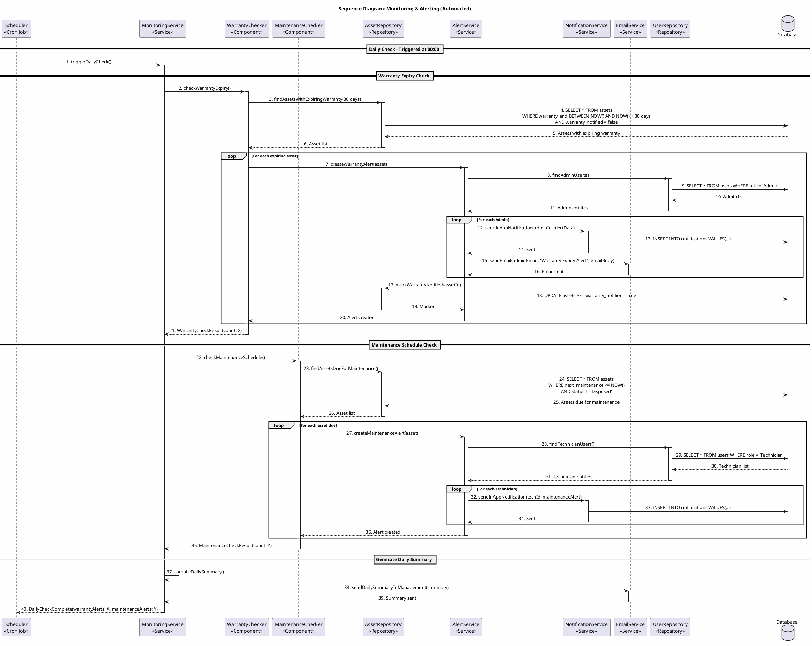
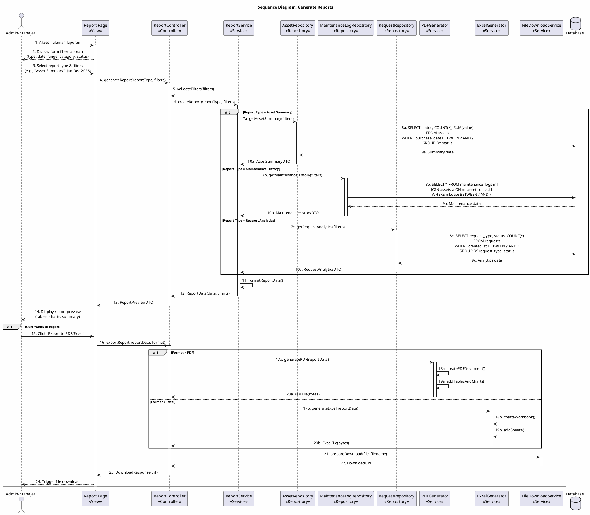
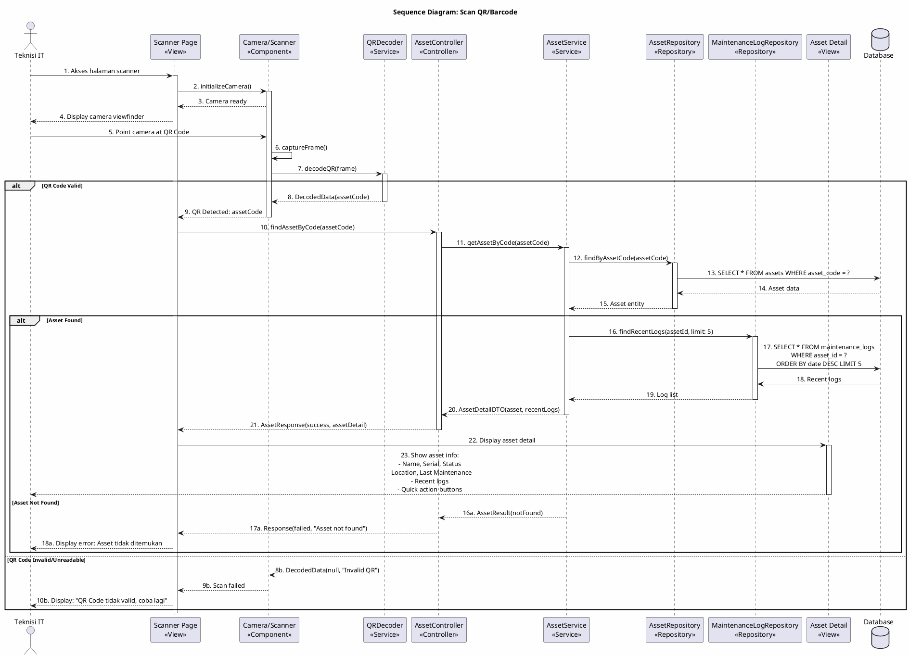
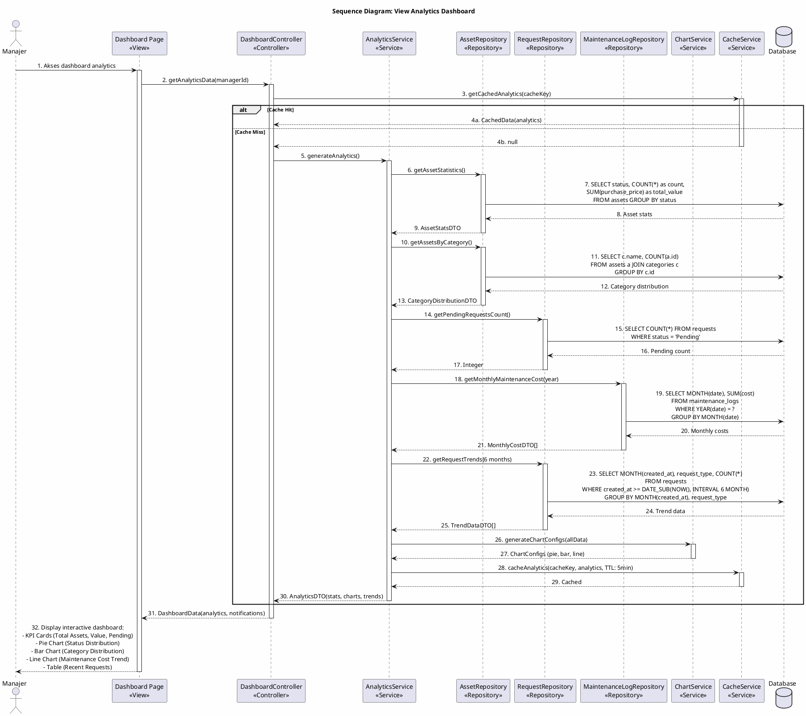

# Sequence Diagram

## 📋 Deskripsi

Sequence Diagram menggambarkan alur interaksi antar objek dalam sistem pada setiap use case yang relevan. Diagram ini menunjukkan urutan pesan yang dikirim antar objek beserta waktu eksekusinya.

---

## 1. Sequence Diagram: Login & Authentication

### Deskripsi

Proses autentikasi pengguna untuk masuk ke sistem. Berlaku untuk semua aktor (Admin, Teknisi, Manajer).

---

## 2. Sequence Diagram: Registrasi Aset Baru

### Deskripsi

Proses pendaftaran aset IT baru ke dalam sistem oleh Administrator IT.

---

## 3. Sequence Diagram: Update Status Aset

### Deskripsi

Proses pembaruan status kondisi aset oleh Teknisi IT.

---

## 4. Sequence Diagram: Input Maintenance Log

### Deskripsi

Proses pencatatan log pemeliharaan/perbaikan aset oleh Teknisi IT.

---

## 5. Sequence Diagram: Submit Replacement Request (Pengajuan Penggantian Aset)

### Deskripsi

Proses pengajuan penggantian/penghapusan aset rusak oleh Teknisi IT.

---

## 6. Sequence Diagram: Approval Process (Proses Persetujuan Manajer)

### Deskripsi

Proses validasi dan persetujuan/penolakan pengajuan oleh Manajer.

---

## 7. Sequence Diagram: Monitoring & Alerting (Sistem Otomatis)

### Deskripsi

Proses monitoring otomatis sistem untuk pengecekan garansi dan jadwal maintenance.

---

## 8. Sequence Diagram: Generate Reports

### Deskripsi

Proses pembuatan dan export laporan oleh Administrator atau Manajer.

---

## 9. Sequence Diagram: Scan QR/Barcode

### Deskripsi

Proses identifikasi aset menggunakan scan QR/Barcode oleh Teknisi.

---

## 10. Sequence Diagram: View Analytics Dashboard (Manajer)

### Deskripsi

Proses menampilkan dashboard analytics untuk Manajer.

---

## Summary Sequence Diagrams

| No  | Diagram                    | Aktor Utama   | Deskripsi                                 |
| --- | -------------------------- | ------------- | ----------------------------------------- |
| 1   | Login & Authentication     | Semua         | Proses autentikasi pengguna               |
| 2   | Registrasi Aset Baru       | Administrator | Pendaftaran aset baru + QR Code           |
| 3   | Update Status Aset         | Teknisi       | Pembaruan kondisi aset                    |
| 4   | Input Maintenance Log      | Teknisi       | Pencatatan log pemeliharaan               |
| 5   | Submit Replacement Request | Teknisi       | Pengajuan penggantian aset                |
| 6   | Approval Process           | Manajer       | Persetujuan/penolakan pengajuan           |
| 7   | Monitoring & Alerting      | Sistem        | Pengecekan otomatis garansi & maintenance |
| 8   | Generate Reports           | Admin/Manajer | Pembuatan dan export laporan              |
| 9   | Scan QR/Barcode            | Teknisi       | Identifikasi aset via scan                |
| 10  | View Analytics Dashboard   | Manajer       | Tampilan dashboard analytics              |
