# Activity Diagram

## 📋 Deskripsi

Activity Diagram menggambarkan alur aktivitas yang terjadi dalam proses bisnis sistem Monitoring dan Manajemen Inventaris Aset IT. Diagram ini menunjukkan langkah-langkah, keputusan, dan percabangan dalam setiap proses.

---

## 1. Activity Diagram: Manajemen Siklus Hidup Aset (Complete Lifecycle)

### Deskripsi

Alur lengkap siklus hidup aset dari pengadaan hingga penghapusan.

---

## 2. Activity Diagram: Proses Login & Autentikasi

### Deskripsi

Alur proses login pengguna ke dalam sistem.

---

## 3. Activity Diagram: Proses Registrasi Aset Baru

### Deskripsi

Alur pendaftaran aset IT baru ke dalam sistem oleh Administrator.

---

## 4. Activity Diagram: Proses Monitoring & Perbaikan Aset

### Deskripsi

Alur pemantauan kondisi dan perbaikan aset oleh Teknisi IT.

---

## 5. Activity Diagram: Proses Pengajuan dan Persetujuan (Approval Workflow)

### Deskripsi

Alur lengkap pengajuan penggantian/penghapusan aset dan proses approval oleh Manajer.

---

## 6. Activity Diagram: Generate & Export Report

### Deskripsi

Alur pembuatan dan ekspor laporan oleh Admin atau Manajer.

---

## 7. Activity Diagram: Scan QR Code & Quick Action

### Deskripsi

Alur penggunaan fitur scan QR untuk identifikasi dan aksi cepat pada aset.

```plantuml
@startuml AD_Scan_QR
skinparam backgroundColor #FEFEFE
skinparam activity {
    BackgroundColor LightGreen
    BorderColor DarkGreen
    DiamondBackgroundColor Gold
}

title Activity Diagram: Scan QR Code & Quick Action

|#LightGreen|Teknisi IT|
|#LightYellow|Sistem|
|#Pink|Kamera Device|

|Teknisi IT|
start

:Buka aplikasi/web di mobile device;
:Akses fitur "Scan Aset";

|Sistem|
:Request permission kamera;

|Kamera Device|
if (Permission granted?) then (Ya)
    :Aktifkan kamera;
    :Display viewfinder;

    |Teknisi IT|
    :Arahkan kamera ke QR Code aset;

    |Kamera Device|
    :Capture frame;
    :Detect QR pattern;

    if (QR Code terdeteksi?) then (Ya)
        :Decode QR data;
        :Kirim asset_code ke sistem;
        :Play beep sound;
        :Show visual feedback;

        |Sistem|
        :Terima asset_code;
        :Query database;

        if (Aset ditemukan?) then (Ya)
            :Load detail aset;
            :Load maintenance history;
            :Load current status;

            :Tampilkan info aset:\n━━━━━━━━━━━━━━━━\n📱 AST-LPT-2026-0001\n━━━━━━━━━━━━━━━━\n🏷️ Dell Latitude 5520\n📍 Ruang IT - Lantai 2\n✅ Status: Active\n🔧 Last Maintenance: 15 Jan 2026\n⏰ Next Maintenance: 15 Apr 2026;

            :Tampilkan quick actions:\n[Update Status]\n[Input Maintenance]\n[View History]\n[Report Issue];

            |Teknisi IT|
            :Pilih quick action;

            if (Action = Update Status?) then
                |Sistem|
                :Tampilkan form status;

                |Teknisi IT|
                :Pilih status baru;
                :Input notes;
                :Submit;

                |Sistem|
                :Update status;
                :Simpan history;
                :Tampilkan konfirmasi;

            elseif (Action = Input Maintenance?) then
                |Sistem|
                :Tampilkan form maintenance;

                |Teknisi IT|
                :Input detail maintenance;
                :Upload foto (opsional);
                :Submit;

                |Sistem|
                :Simpan log maintenance;
                :Tampilkan konfirmasi;

            elseif (Action = View History?) then
                |Sistem|
                :Load full history;
                :Tampilkan timeline;

                |Teknisi IT|
                :Review history;

            else (Action = Report Issue)
                |Sistem|
                :Tampilkan form issue;

                |Teknisi IT|
                :Describe issue;
                :Attach photos;
                :Set priority;
                :Submit;

                |Sistem|
                :Create issue ticket;
                :Notify relevant parties;
            endif

        else (Tidak - Aset tidak ada)
            |Sistem|
            :Tampilkan error:\n"Aset tidak ditemukan dalam sistem";

            |Teknisi IT|
            if (Ingin registrasi?) then (Ya)
                :Scan adalah aset baru;
                :Redirect ke form registrasi;
                note right
                    Lanjut ke alur
                    Registrasi Aset
                end note
            else (Tidak)
                :QR mungkin rusak/salah;
                :Cari manual di sistem;
            endif
        endif

    else (Tidak - QR tidak terdeteksi)
        |Kamera Device|
        :Lanjut capture;

        |Teknisi IT|
        :Adjust posisi/jarak;

        if (Timeout 10 detik?) then (Ya)
            |Sistem|
            :Tampilkan tips:\n- Pastikan pencahayaan cukup\n- Bersihkan QR Code\n- Jaga jarak 10-20 cm;

            |Teknisi IT|
            if (Coba lagi?) then (Ya)
                :Reset scanner;
            else (Tidak)
                :Input asset code manual;
            endif
        endif
    endif

else (Tidak - Permission denied)
    |Sistem|
    :Tampilkan pesan:\n"Izin kamera diperlukan";
    :Tampilkan opsi input manual;

    |Teknisi IT|
    :Grant permission atau input manual;
endif

stop

@enduml
```

---

## 8. Activity Diagram: Sistem Notifikasi Otomatis

### Deskripsi

Alur sistem notifikasi otomatis untuk berbagai event.

---

## Summary Activity Diagrams

| No  | Diagram                     | Deskripsi                                          | Aktor Terlibat                  |
| --- | --------------------------- | -------------------------------------------------- | ------------------------------- |
| 1   | Manajemen Siklus Hidup Aset | Lifecycle lengkap dari registrasi hingga disposal  | Admin, Teknisi, Manajer, Sistem |
| 2   | Proses Login & Autentikasi  | Alur login dengan validasi dan role-based redirect | Semua User, Sistem              |
| 3   | Registrasi Aset Baru        | Pendaftaran aset baru lengkap dengan QR generation | Admin, Sistem                   |
| 4   | Monitoring & Perbaikan      | Pemantauan kondisi dan proses perbaikan            | Teknisi, Sistem, Manajer        |
| 5   | Pengajuan & Persetujuan     | Workflow approval untuk disposal/replacement       | Teknisi, Manajer, Admin         |
| 6   | Generate & Export Report    | Pembuatan laporan dengan berbagai format export    | Admin/Manajer, Sistem           |
| 7   | Scan QR & Quick Action      | Identifikasi aset dan aksi cepat via mobile        | Teknisi, Sistem                 |
| 8   | Sistem Notifikasi Otomatis  | Automatic notification untuk berbagai event        | Sistem, Delivery Service        |
