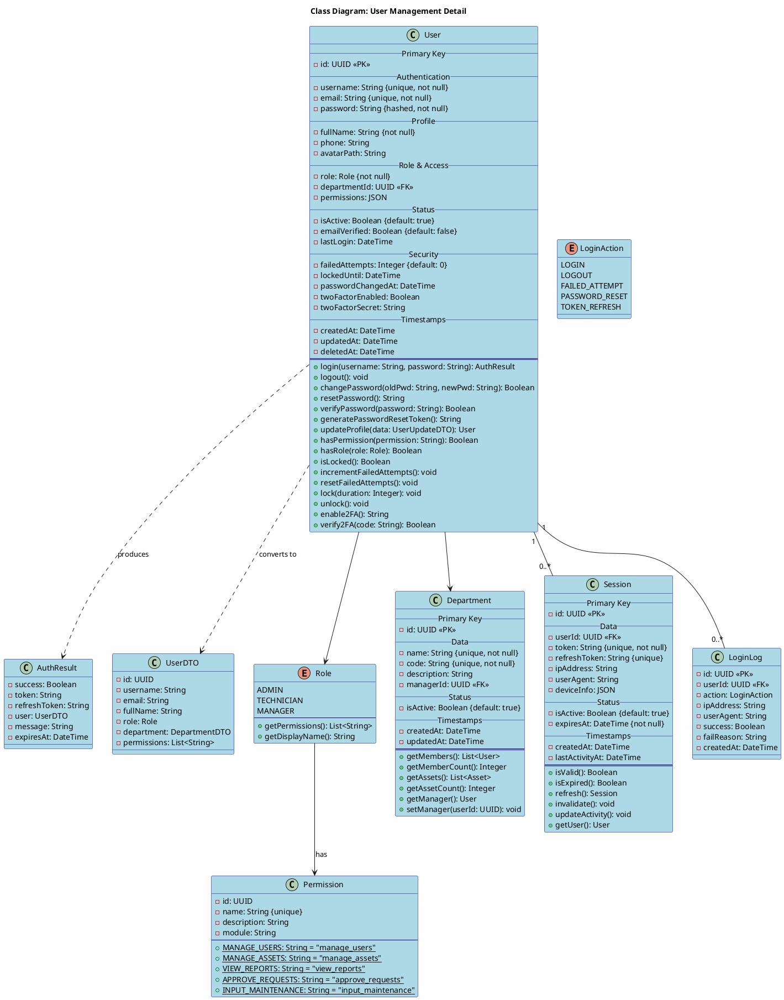
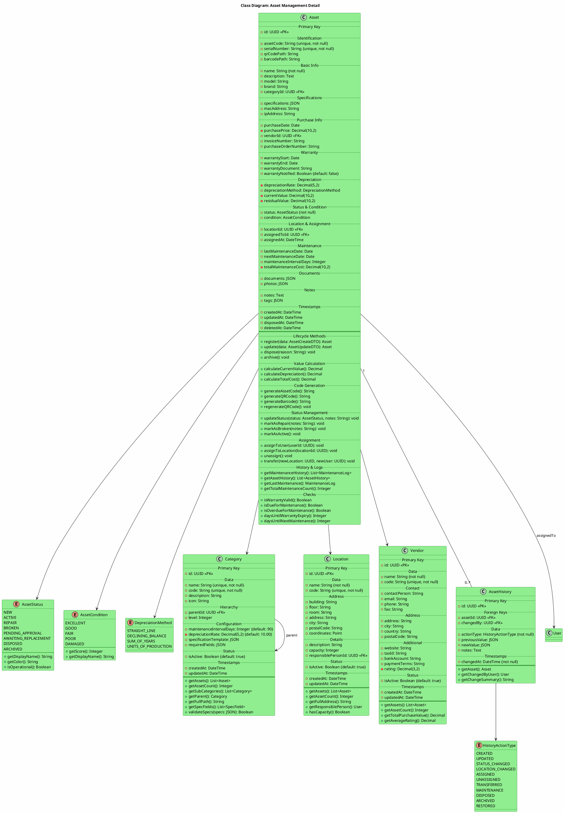
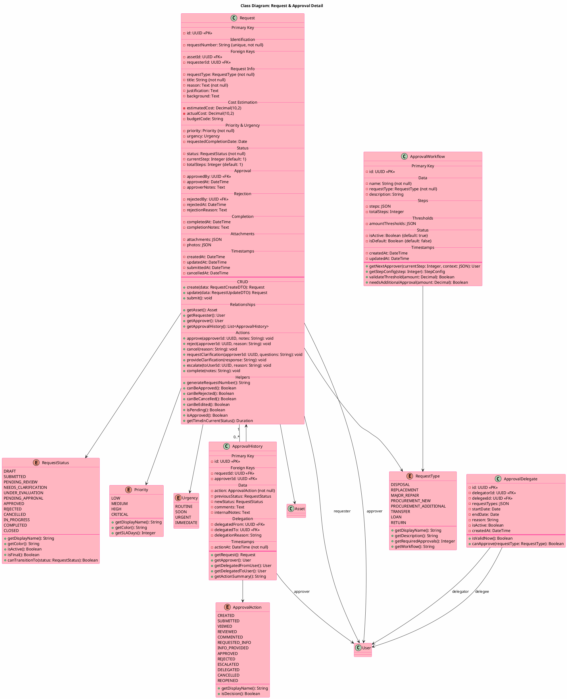
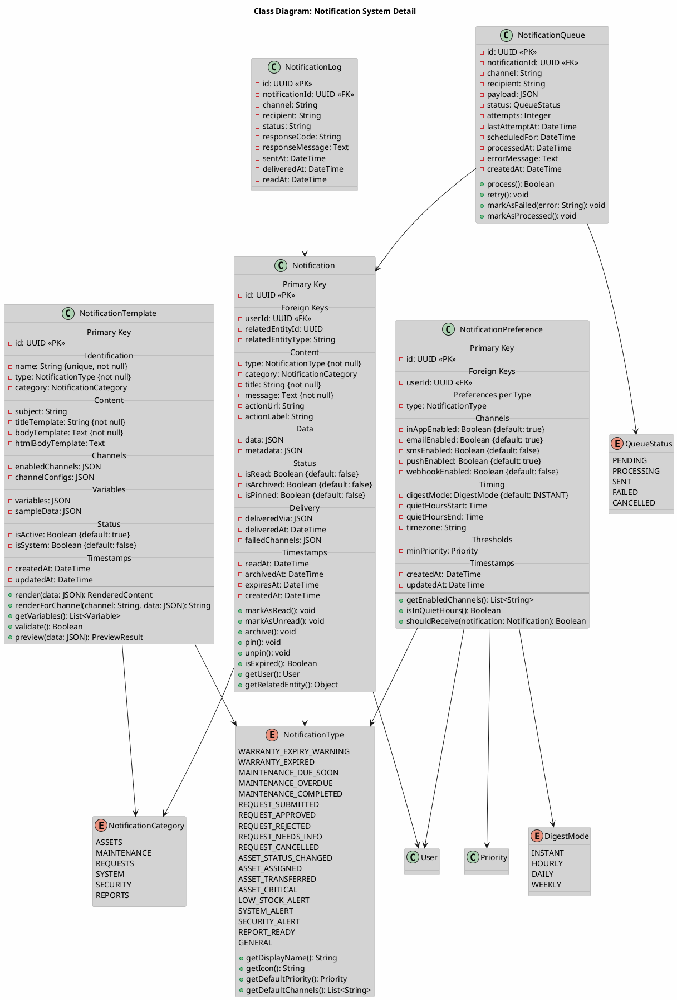

# Class Diagram

## 📋 Deskripsi

Class Diagram menggambarkan struktur kelas dalam sistem Monitoring dan Manajemen Inventaris Aset IT beserta atribut, metode, dan relasi antar kelas. Diagram ini menjadi dasar perancangan database dan implementasi backend.

---

## Class Diagram Utama (Overview)

```plantuml
@startuml Class_Diagram_Overview
skinparam backgroundColor #FEFEFE
skinparam class {
    BackgroundColor LightYellow
    BorderColor DarkOrange
    ArrowColor DarkBlue
}
skinparam stereotypeCBackgroundColor LightBlue

title Class Diagram: Sistem Manajemen Aset IT - Overview

' ========== ENTITY CLASSES ==========

package "User Management" #LightBlue {

    class User {
        - id: UUID
        - username: String
        - email: String
        - password: String
        - fullName: String
        - phone: String
        - role: Role
        - departmentId: UUID
        - isActive: Boolean
        - lastLogin: DateTime
        - failedAttempts: Integer
        - lockedUntil: DateTime
        - createdAt: DateTime
        - updatedAt: DateTime
        --
        + login(username, password): AuthResult
        + logout(): void
        + changePassword(oldPwd, newPwd): Boolean
        + resetPassword(): String
        + updateProfile(data): User
        + hasPermission(permission): Boolean
    }

    enum Role {
        ADMIN
        TECHNICIAN
        MANAGER
    }

    class Department {
        - id: UUID
        - name: String
        - code: String
        - description: String
        - managerId: UUID
        - createdAt: DateTime
        --
        + getMembers(): List<User>
        + getAssets(): List<Asset>
        + getManager(): User
    }

    class Session {
        - id: UUID
        - userId: UUID
        - token: String
        - ipAddress: String
        - userAgent: String
        - expiresAt: DateTime
        - createdAt: DateTime
        --
        + isValid(): Boolean
        + refresh(): Session
        + invalidate(): void
    }
}

package "Asset Management" #LightGreen {

    class Asset {
        - id: UUID
        - assetCode: String
        - serialNumber: String
        - name: String
        - model: String
        - brand: String
        - categoryId: UUID
        - specifications: JSON
        - purchaseDate: Date
        - purchasePrice: Decimal
        - vendorId: UUID
        - warrantyStart: Date
        - warrantyEnd: Date
        - status: AssetStatus
        - condition: AssetCondition
        - locationId: UUID
        - assignedToId: UUID
        - qrCodePath: String
        - barcodePath: String
        - lastMaintenanceDate: Date
        - nextMaintenanceDate: Date
        - depreciationRate: Decimal
        - currentValue: Decimal
        - notes: Text
        - warrantyNotified: Boolean
        - createdAt: DateTime
        - updatedAt: DateTime
        --
        + calculateCurrentValue(): Decimal
        + generateQRCode(): String
        + generateBarcode(): String
        + updateStatus(status, notes): void
        + assignToUser(userId): void
        + assignToLocation(locationId): void
        + getMaintenanceHistory(): List<MaintenanceLog>
        + getAssetHistory(): List<AssetHistory>
        + isWarrantyValid(): Boolean
        + isDueForMaintenance(): Boolean
    }

    enum AssetStatus {
        NEW
        ACTIVE
        REPAIR
        BROKEN
        PENDING_APPROVAL
        AWAITING_REPLACEMENT
        DISPOSED
        ARCHIVED
    }

    enum AssetCondition {
        EXCELLENT
        GOOD
        FAIR
        POOR
        DAMAGED
    }

    class Category {
        - id: UUID
        - name: String
        - code: String
        - description: String
        - parentId: UUID
        - maintenanceIntervalDays: Integer
        - depreciationRate: Decimal
        - specificationTemplate: JSON
        - isActive: Boolean
        - createdAt: DateTime
        --
        + getAssets(): List<Asset>
        + getSubCategories(): List<Category>
        + getSpecFields(): List<String>
    }

    class Location {
        - id: UUID
        - name: String
        - code: String
        - building: String
        - floor: String
        - room: String
        - address: String
        - description: String
        - isActive: Boolean
        - createdAt: DateTime
        --
        + getAssets(): List<Asset>
        + getFullAddress(): String
    }

    class Vendor {
        - id: UUID
        - name: String
        - code: String
        - contactPerson: String
        - email: String
        - phone: String
        - address: String
        - website: String
        - isActive: Boolean
        - createdAt: DateTime
        --
        + getAssets(): List<Asset>
        + getPurchaseOrders(): List<PurchaseOrder>
    }

    class AssetHistory {
        - id: UUID
        - assetId: UUID
        - actionType: HistoryActionType
        - previousValue: JSON
        - newValue: JSON
        - changedBy: UUID
        - changedAt: DateTime
        - notes: Text
        --
        + getAsset(): Asset
        + getChangedByUser(): User
    }

    enum HistoryActionType {
        CREATED
        STATUS_CHANGED
        LOCATION_CHANGED
        ASSIGNED
        UNASSIGNED
        MAINTENANCE
        DISPOSED
        UPDATED
    }
}

package "Maintenance Management" #LightCoral {

    class MaintenanceLog {
        - id: UUID
        - assetId: UUID
        - technicianId: UUID
        - maintenanceType: MaintenanceType
        - description: Text
        - findings: Text
        - actionTaken: Text
        - partsReplaced: JSON
        - cost: Decimal
        - laborHours: Decimal
        - status: MaintenanceStatus
        - scheduledDate: Date
        - startedAt: DateTime
        - completedAt: DateTime
        - attachments: JSON
        - createdAt: DateTime
        --
        + getAsset(): Asset
        + getTechnician(): User
        + calculateTotalCost(): Decimal
        + markAsComplete(): void
    }

    enum MaintenanceType {
        PREVENTIVE
        CORRECTIVE
        INSPECTION
        CLEANING
        UPGRADE
        EMERGENCY
    }

    enum MaintenanceStatus {
        SCHEDULED
        IN_PROGRESS
        COMPLETED
        CANCELLED
        POSTPONED
    }

    class MaintenanceSchedule {
        - id: UUID
        - assetId: UUID
        - scheduleType: ScheduleType
        - intervalDays: Integer
        - nextDueDate: Date
        - lastPerformedDate: Date
        - isActive: Boolean
        - createdAt: DateTime
        --
        + calculateNextDue(): Date
        + isOverdue(): Boolean
    }

    enum ScheduleType {
        DAILY
        WEEKLY
        MONTHLY
        QUARTERLY
        YEARLY
        CUSTOM
    }
}

package "Request & Approval" #LightPink {

    class Request {
        - id: UUID
        - requestNumber: String
        - assetId: UUID
        - requesterId: UUID
        - requestType: RequestType
        - reason: Text
        - justification: Text
        - estimatedCost: Decimal
        - priority: Priority
        - status: RequestStatus
        - attachments: JSON
        - approvedBy: UUID
        - approvedAt: DateTime
        - rejectedBy: UUID
        - rejectedAt: DateTime
        - rejectionReason: Text
        - createdAt: DateTime
        - updatedAt: DateTime
        --
        + getAsset(): Asset
        + getRequester(): User
        + getApprover(): User
        + approve(managerId, notes): void
        + reject(managerId, reason): void
        + cancel(): void
        + generateRequestNumber(): String
    }

    enum RequestType {
        DISPOSAL
        REPLACEMENT
        REPAIR
        TRANSFER
        PROCUREMENT
    }

    enum RequestStatus {
        DRAFT
        PENDING
        NEEDS_CLARIFICATION
        APPROVED
        REJECTED
        CANCELLED
        COMPLETED
    }

    enum Priority {
        LOW
        MEDIUM
        HIGH
        CRITICAL
    }

    class ApprovalHistory {
        - id: UUID
        - requestId: UUID
        - approverId: UUID
        - action: ApprovalAction
        - comments: Text
        - actionAt: DateTime
        --
        + getRequest(): Request
        + getApprover(): User
    }

    enum ApprovalAction {
        SUBMITTED
        REVIEWED
        REQUESTED_INFO
        APPROVED
        REJECTED
        ESCALATED
    }
}

package "Notification System" #LightGray {

    class Notification {
        - id: UUID
        - userId: UUID
        - type: NotificationType
        - title: String
        - message: Text
        - data: JSON
        - isRead: Boolean
        - readAt: DateTime
        - createdAt: DateTime
        --
        + markAsRead(): void
        + getUser(): User
    }

    enum NotificationType {
        WARRANTY_EXPIRY
        MAINTENANCE_DUE
        REQUEST_SUBMITTED
        REQUEST_APPROVED
        REQUEST_REJECTED
        ASSET_CRITICAL
        SYSTEM_ALERT
        GENERAL
    }

    class NotificationTemplate {
        - id: UUID
        - name: String
        - type: NotificationType
        - subject: String
        - bodyTemplate: Text
        - channels: JSON
        - isActive: Boolean
        --
        + render(data): String
    }

    class NotificationPreference {
        - id: UUID
        - userId: UUID
        - type: NotificationType
        - emailEnabled: Boolean
        - inAppEnabled: Boolean
        - smsEnabled: Boolean
        --
        + getEnabledChannels(): List<String>
    }
}

' ========== RELATIONSHIPS ==========

User "1" -- "0..*" Session : has >
User "1" -- "0..*" Notification : receives >
User "1" -- "0..1" NotificationPreference : has >
User "*" -- "1" Role : has >
User "*" -- "1" Department : belongs to >
Department "1" -- "0..1" User : managed by >

Asset "*" -- "1" Category : belongs to >
Asset "*" -- "0..1" Location : placed at >
Asset "*" -- "0..1" Vendor : purchased from >
Asset "*" -- "0..1" User : assigned to >
Asset "1" -- "0..*" MaintenanceLog : has >
Asset "1" -- "0..*" AssetHistory : has >
Asset "1" -- "0..*" Request : subject of >
Asset "1" -- "0..1" MaintenanceSchedule : has >

Category "0..1" -- "*" Category : parent of >

MaintenanceLog "*" -- "1" User : performed by >

Request "1" -- "0..*" ApprovalHistory : has >
Request "*" -- "1" User : requested by >
Request "*" -- "0..1" User : approved by >

Notification "*" -- "1" NotificationType : of type >
NotificationTemplate "*" -- "1" NotificationType : for >

@enduml
```

---

## Class Diagram Detail per Package

### A. User Management Classes

---

### B. Asset Management Classes

---

### C. Maintenance Management Classes

```plantuml
@startuml Class_Maintenance
skinparam backgroundColor #FEFEFE
skinparam class {
    BackgroundColor LightCoral
    BorderColor DarkRed
}

title Class Diagram: Maintenance Management Detail

class MaintenanceLog {
    __ Primary Key __
    - id: UUID <<PK>>
    __ Foreign Keys __
    - assetId: UUID <<FK>>
    - technicianId: UUID <<FK>>
    - scheduleId: UUID <<FK>>
    __ Basic Info __
    - maintenanceNumber: String {unique, not null}
    - maintenanceType: MaintenanceType {not null}
    - title: String {not null}
    __ Description __
    - description: Text
    - findings: Text
    - actionTaken: Text
    - recommendation: Text
    __ Parts & Cost __
    - partsReplaced: JSON
    - partsCost: Decimal(10,2)
    - laborCost: Decimal(10,2)
    - otherCost: Decimal(10,2)
    - totalCost: Decimal(10,2)
    __ Labor __
    - laborHours: Decimal(5,2)
    - technicianNotes: Text
    __ Status & Schedule __
    - status: MaintenanceStatus {not null}
    - priority: Priority
    - scheduledDate: Date
    - dueDate: Date
    __ Execution __
    - startedAt: DateTime
    - completedAt: DateTime
    - verifiedBy: UUID <<FK>>
    - verifiedAt: DateTime
    __ Attachments __
    - beforePhotos: JSON
    - afterPhotos: JSON
    - documents: JSON
    __ Timestamps __
    - createdAt: DateTime
    - updatedAt: DateTime
    ==
    __ CRUD __
    + create(data: MaintenanceCreateDTO): MaintenanceLog
    + update(data: MaintenanceUpdateDTO): MaintenanceLog
    __ Relationships __
    + getAsset(): Asset
    + getTechnician(): User
    + getVerifier(): User
    + getSchedule(): MaintenanceSchedule
    __ Cost __
    + calculateTotalCost(): Decimal
    + addPart(part: PartDTO): void
    + removePart(partId: UUID): void
    __ Status __
    + start(): void
    + complete(): void
    + cancel(reason: String): void
    + postpone(newDate: Date): void
    + verify(verifierId: UUID): void
    __ Helpers __
    + getDuration(): Duration
    + isOverdue(): Boolean
    + generateMaintenanceNumber(): String
}

enum MaintenanceType {
    PREVENTIVE
    CORRECTIVE
    PREDICTIVE
    INSPECTION
    CLEANING
    CALIBRATION
    UPGRADE
    EMERGENCY
    --
    + getDisplayName(): String
    + getDescription(): String
    + getIcon(): String
}

enum MaintenanceStatus {
    DRAFT
    SCHEDULED
    ASSIGNED
    IN_PROGRESS
    PENDING_PARTS
    ON_HOLD
    COMPLETED
    VERIFIED
    CANCELLED
    --
    + getDisplayName(): String
    + getColor(): String
    + isActive(): Boolean
    + isFinal(): Boolean
}

class MaintenanceSchedule {
    __ Primary Key __
    - id: UUID <<PK>>
    __ Foreign Keys __
    - assetId: UUID <<FK>>
    - assignedTo: UUID <<FK>>
    __ Schedule Config __
    - scheduleType: ScheduleType {not null}
    - intervalDays: Integer
    - intervalWeeks: Integer
    - intervalMonths: Integer
    - dayOfWeek: Integer
    - dayOfMonth: Integer
    - customCron: String
    __ Dates __
    - startDate: Date {not null}
    - endDate: Date
    - nextDueDate: Date
    - lastPerformedDate: Date
    __ Notifications __
    - reminderDays: Integer {default: 7}
    - notifyTechnician: Boolean {default: true}
    - notifyAdmin: Boolean {default: true}
    __ Status __
    - isActive: Boolean {default: true}
    - isPaused: Boolean {default: false}
    __ Timestamps __
    - createdAt: DateTime
    - updatedAt: DateTime
    ==
    + getAsset(): Asset
    + getAssignedTechnician(): User
    + calculateNextDue(): Date
    + isOverdue(): Boolean
    + isDueSoon(days: Integer): Boolean
    + pause(): void
    + resume(): void
    + skip(): void
    + markPerformed(date: Date): void
    + getUpcomingDates(count: Integer): List<Date>
}

enum ScheduleType {
    DAILY
    WEEKLY
    BIWEEKLY
    MONTHLY
    QUARTERLY
    SEMI_ANNUALLY
    YEARLY
    CUSTOM
    --
    + getIntervalDays(): Integer
    + getDisplayName(): String
}

class Part {
    __ Primary Key __
    - id: UUID <<PK>>
    __ Data __
    - name: String {not null}
    - partNumber: String {unique}
    - description: String
    - categoryId: UUID <<FK>>
    __ Pricing __
    - unitPrice: Decimal(10,2)
    - currency: String {default: "IDR"}
    __ Stock __
    - stockQuantity: Integer {default: 0}
    - minStockLevel: Integer {default: 5}
    - reorderPoint: Integer {default: 10}
    __ Supplier __
    - vendorId: UUID <<FK>>
    - leadTimeDays: Integer
    __ Status __
    - isActive: Boolean {default: true}
    __ Timestamps __
    - createdAt: DateTime
    - updatedAt: DateTime
    ==
    + isLowStock(): Boolean
    + needsReorder(): Boolean
    + getVendor(): Vendor
}

class PartUsage {
    - id: UUID <<PK>>
    - maintenanceLogId: UUID <<FK>>
    - partId: UUID <<FK>>
    - quantity: Integer {not null}
    - unitPrice: Decimal(10,2)
    - totalPrice: Decimal(10,2)
    - notes: String
    - createdAt: DateTime
    ==
    + getPart(): Part
    + getMaintenanceLog(): MaintenanceLog
    + calculateTotal(): Decimal
}

MaintenanceLog --> MaintenanceType
MaintenanceLog --> MaintenanceStatus
MaintenanceLog --> Priority
MaintenanceLog --> Asset
MaintenanceLog --> User : technician
MaintenanceLog --> User : verifier
MaintenanceLog --> MaintenanceSchedule
MaintenanceLog "1" -- "0..*" PartUsage

MaintenanceSchedule --> ScheduleType
MaintenanceSchedule --> Asset
MaintenanceSchedule --> User : assignedTo

PartUsage --> Part
PartUsage --> MaintenanceLog

Part --> Vendor

@enduml
```

---

### D. Request & Approval Classes

---

### E. Notification System Classes

---

## Class Diagram: Services & Repositories

```plantuml
@startuml Class_Services
skinparam backgroundColor #FEFEFE
skinparam class {
    BackgroundColor LightCyan
    BorderColor DarkCyan
}

title Class Diagram: Services & Repositories

package "Services" #LightCyan {

    class AuthService <<Service>> {
        - userRepository: UserRepository
        - sessionRepository: SessionRepository
        - passwordEncoder: PasswordEncoder
        - jwtService: JwtService
        --
        + authenticate(username, password): AuthResult
        + refreshToken(refreshToken): AuthResult
        + logout(token): void
        + validateToken(token): User
        + changePassword(userId, oldPwd, newPwd): Boolean
        + resetPassword(email): String
        + enable2FA(userId): String
        + verify2FA(userId, code): Boolean
    }

    class AssetService <<Service>> {
        - assetRepository: AssetRepository
        - categoryRepository: CategoryRepository
        - historyRepository: AssetHistoryRepository
        - qrCodeService: QRCodeService
        - notificationService: NotificationService
        --
        + createAsset(data): Asset
        + updateAsset(id, data): Asset
        + deleteAsset(id): void
        + getAssetById(id): Asset
        + getAssetByCode(code): Asset
        + searchAssets(criteria): Page<Asset>
        + updateStatus(id, status, notes): Asset
        + assignAsset(id, userId, locationId): Asset
        + transferAsset(id, newLocation, newUser): Asset
        + disposeAsset(id, reason): void
        + calculateDepreciation(id): Decimal
    }

    class MaintenanceService <<Service>> {
        - maintenanceLogRepository: MaintenanceLogRepository
        - scheduleRepository: MaintenanceScheduleRepository
        - assetRepository: AssetRepository
        - notificationService: NotificationService
        --
        + createMaintenanceLog(data): MaintenanceLog
        + updateMaintenanceLog(id, data): MaintenanceLog
        + completeMaintenacement(id, data): MaintenanceLog
        + getMaintenanceSchedule(assetId): MaintenanceSchedule
        + createSchedule(data): MaintenanceSchedule
        + getDueMaintenances(): List<MaintenanceSchedule>
        + getOverdueMaintenances(): List<MaintenanceSchedule>
        + sendMaintenanceReminders(): void
    }

    class RequestService <<Service>> {
        - requestRepository: RequestRepository
        - approvalHistoryRepository: ApprovalHistoryRepository
        - assetRepository: AssetRepository
        - notificationService: NotificationService
        --
        + createRequest(data): Request
        + submitRequest(id): Request
        + approveRequest(id, approverId, notes): Request
        + rejectRequest(id, approverId, reason): Request
        + cancelRequest(id, reason): Request
        + getPendingRequests(): List<Request>
        + getRequestsByUser(userId): List<Request>
        + processApprovedRequest(id): void
    }

    class NotificationService <<Service>> {
        - notificationRepository: NotificationRepository
        - templateRepository: NotificationTemplateRepository
        - preferenceRepository: NotificationPreferenceRepository
        - emailService: EmailService
        - smsService: SMSService
        - pushService: PushService
        --
        + sendNotification(userId, type, data): Notification
        + sendBulkNotification(userIds, type, data): List<Notification>
        + markAsRead(id): void
        + markAllAsRead(userId): void
        + getUnreadCount(userId): Integer
        + getUserNotifications(userId, page): Page<Notification>
    }

    class ReportService <<Service>> {
        - assetRepository: AssetRepository
        - maintenanceRepository: MaintenanceLogRepository
        - requestRepository: RequestRepository
        - pdfGenerator: PDFGenerator
        - excelGenerator: ExcelGenerator
        --
        + generateAssetSummary(filters): ReportData
        + generateMaintenanceReport(filters): ReportData
        + generateCostAnalysis(filters): ReportData
        + generateDepreciationReport(filters): ReportData
        + exportToPDF(reportData): byte[]
        + exportToExcel(reportData): byte[]
        + scheduleReport(config): ScheduledReport
    }

    class QRCodeService <<Service>> {
        - storageService: StorageService
        --
        + generateQRCode(data): String
        + generateBarcode(data): String
        + decodeQRCode(image): String
        + regenerateQRCode(assetId): String
    }

    class MonitoringService <<Service>> {
        - assetRepository: AssetRepository
        - scheduleRepository: MaintenanceScheduleRepository
        - notificationService: NotificationService
        --
        + checkWarrantyExpiry(): void
        + checkMaintenanceSchedule(): void
        + checkAssetConditions(): void
        + generateDailySummary(): DailySummary
        + runDailyChecks(): void
    }
}

package "Repositories" #LightGreen {

    interface UserRepository <<Repository>> {
        + findById(id): User
        + findByUsername(username): User
        + findByEmail(email): User
        + findByRole(role): List<User>
        + findByDepartment(deptId): List<User>
        + save(user): User
        + delete(id): void
        + existsByUsername(username): Boolean
        + existsByEmail(email): Boolean
    }

    interface AssetRepository <<Repository>> {
        + findById(id): Asset
        + findByAssetCode(code): Asset
        + findBySerialNumber(sn): Asset
        + findByCategory(categoryId): List<Asset>
        + findByStatus(status): List<Asset>
        + findByLocation(locationId): List<Asset>
        + findByAssignedTo(userId): List<Asset>
        + findWithExpiringWarranty(days): List<Asset>
        + findDueForMaintenance(): List<Asset>
        + save(asset): Asset
        + delete(id): void
        + search(criteria): Page<Asset>
    }

    interface MaintenanceLogRepository <<Repository>> {
        + findById(id): MaintenanceLog
        + findByAssetId(assetId): List<MaintenanceLog>
        + findByTechnicianId(techId): List<MaintenanceLog>
        + findByStatus(status): List<MaintenanceLog>
        + findByDateRange(start, end): List<MaintenanceLog>
        + save(log): MaintenanceLog
        + getTotalCostByAsset(assetId): Decimal
        + getMonthlyStats(year): List<MonthlyStat>
    }

    interface RequestRepository <<Repository>> {
        + findById(id): Request
        + findByRequestNumber(number): Request
        + findByStatus(status): List<Request>
        + findByRequesterId(userId): List<Request>
        + findPendingForApprover(approverId): List<Request>
        + save(request): Request
        + countByStatus(status): Integer
        + getRequestStats(dateRange): RequestStats
    }

    interface NotificationRepository <<Repository>> {
        + findById(id): Notification
        + findByUserId(userId): List<Notification>
        + findUnreadByUserId(userId): List<Notification>
        + countUnreadByUserId(userId): Integer
        + save(notification): Notification
        + markAsRead(id): void
        + markAllAsReadByUserId(userId): void
        + deleteOldNotifications(before): Integer
    }
}

' Service dependencies
AuthService --> UserRepository
AuthService --> SessionRepository

AssetService --> AssetRepository
AssetService --> CategoryRepository
AssetService --> AssetHistoryRepository
AssetService --> QRCodeService
AssetService --> NotificationService

MaintenanceService --> MaintenanceLogRepository
MaintenanceService --> MaintenanceScheduleRepository
MaintenanceService --> AssetRepository
MaintenanceService --> NotificationService

RequestService --> RequestRepository
RequestService --> ApprovalHistoryRepository
RequestService --> AssetRepository
RequestService --> NotificationService

NotificationService --> NotificationRepository
NotificationService --> NotificationTemplateRepository
NotificationService --> NotificationPreferenceRepository

ReportService --> AssetRepository
ReportService --> MaintenanceLogRepository
ReportService --> RequestRepository

MonitoringService --> AssetRepository
MonitoringService --> MaintenanceScheduleRepository
MonitoringService --> NotificationService

@enduml
```

---

## Summary Class Diagram

| Package                | Kelas Utama                                                | Deskripsi                                      |
| ---------------------- | ---------------------------------------------------------- | ---------------------------------------------- |
| **User Management**    | User, Role, Department, Session                            | Manajemen pengguna, autentikasi, dan otorisasi |
| **Asset Management**   | Asset, Category, Location, Vendor, AssetHistory            | Manajemen data aset dan master data            |
| **Maintenance**        | MaintenanceLog, MaintenanceSchedule, Part                  | Pencatatan dan penjadwalan maintenance         |
| **Request & Approval** | Request, ApprovalHistory, ApprovalWorkflow                 | Workflow pengajuan dan persetujuan             |
| **Notification**       | Notification, NotificationTemplate, NotificationPreference | Sistem notifikasi multi-channel                |
| **Services**           | AuthService, AssetService, MaintenanceService, dll         | Business logic layer                           |
| **Repositories**       | UserRepository, AssetRepository, dll                       | Data access layer                              |

---

## Relasi Antar Kelas

| Relasi         | Dari           | Ke              | Tipe        | Kardinalitas |
| -------------- | -------------- | --------------- | ----------- | ------------ |
| belongs to     | User           | Department      | Association | N:1          |
| has            | User           | Session         | Composition | 1:N          |
| belongs to     | Asset          | Category        | Association | N:1          |
| placed at      | Asset          | Location        | Association | N:0..1       |
| assigned to    | Asset          | User            | Association | N:0..1       |
| purchased from | Asset          | Vendor          | Association | N:0..1       |
| has            | Asset          | MaintenanceLog  | Composition | 1:N          |
| has            | Asset          | AssetHistory    | Composition | 1:N          |
| subject of     | Asset          | Request         | Association | 1:N          |
| performed by   | MaintenanceLog | User            | Association | N:1          |
| requested by   | Request        | User            | Association | N:1          |
| has            | Request        | ApprovalHistory | Composition | 1:N          |
| receives       | User           | Notification    | Association | 1:N          |
