# Database Schema

## 📋 Deskripsi

Dokumen ini menjelaskan skema database lengkap untuk Sistem Monitoring dan Manajemen Inventaris Aset IT. Skema dirancang menggunakan PostgreSQL dengan normalisasi yang baik dan relasi yang tepat.

---

## Entity Relationship Diagram (ERD)

```plantuml
@startuml ERD_Complete
skinparam backgroundColor #FEFEFE
skinparam linetype ortho

title Entity Relationship Diagram: IT Asset Management System

' Hide the circle
hide circle

' Avoid flickering
skinparam handwritten false

entity "users" as users {
    * id : UUID <<PK>>
    --
    * username : VARCHAR(50) <<unique>>
    * email : VARCHAR(100) <<unique>>
    * password : VARCHAR(255)
    * full_name : VARCHAR(100)
    phone : VARCHAR(20)
    avatar_path : VARCHAR(255)
    * role : user_role
    department_id : UUID <<FK>>
    * is_active : BOOLEAN
    email_verified : BOOLEAN
    last_login : TIMESTAMP
    failed_attempts : INTEGER
    locked_until : TIMESTAMP
    password_changed_at : TIMESTAMP
    two_factor_enabled : BOOLEAN
    two_factor_secret : VARCHAR(100)
    * created_at : TIMESTAMP
    * updated_at : TIMESTAMP
    deleted_at : TIMESTAMP
}

entity "departments" as departments {
    * id : UUID <<PK>>
    --
    * name : VARCHAR(100) <<unique>>
    * code : VARCHAR(20) <<unique>>
    description : TEXT
    manager_id : UUID <<FK>>
    * is_active : BOOLEAN
    * created_at : TIMESTAMP
    * updated_at : TIMESTAMP
}

entity "sessions" as sessions {
    * id : UUID <<PK>>
    --
    * user_id : UUID <<FK>>
    * token : VARCHAR(500) <<unique>>
    refresh_token : VARCHAR(500)
    ip_address : VARCHAR(45)
    user_agent : TEXT
    device_info : JSONB
    * is_active : BOOLEAN
    * expires_at : TIMESTAMP
    * created_at : TIMESTAMP
    last_activity_at : TIMESTAMP
}

entity "assets" as assets {
    * id : UUID <<PK>>
    --
    * asset_code : VARCHAR(50) <<unique>>
    * serial_number : VARCHAR(100) <<unique>>
    qr_code_path : VARCHAR(255)
    barcode_path : VARCHAR(255)
    * name : VARCHAR(200)
    description : TEXT
    model : VARCHAR(100)
    brand : VARCHAR(100)
    * category_id : UUID <<FK>>
    specifications : JSONB
    mac_address : VARCHAR(17)
    ip_address : VARCHAR(45)
    purchase_date : DATE
    purchase_price : DECIMAL(15,2)
    vendor_id : UUID <<FK>>
    invoice_number : VARCHAR(100)
    warranty_start : DATE
    warranty_end : DATE
    warranty_document : VARCHAR(255)
    warranty_notified : BOOLEAN
    depreciation_rate : DECIMAL(5,2)
    depreciation_method : depreciation_method
    current_value : DECIMAL(15,2)
    residual_value : DECIMAL(15,2)
    * status : asset_status
    condition : asset_condition
    location_id : UUID <<FK>>
    assigned_to_id : UUID <<FK>>
    assigned_at : TIMESTAMP
    last_maintenance_date : DATE
    next_maintenance_date : DATE
    maintenance_interval_days : INTEGER
    total_maintenance_cost : DECIMAL(15,2)
    documents : JSONB
    photos : JSONB
    notes : TEXT
    tags : JSONB
    * created_at : TIMESTAMP
    * updated_at : TIMESTAMP
    disposed_at : TIMESTAMP
    deleted_at : TIMESTAMP
}

entity "categories" as categories {
    * id : UUID <<PK>>
    --
    * name : VARCHAR(100) <<unique>>
    * code : VARCHAR(20) <<unique>>
    description : TEXT
    icon : VARCHAR(50)
    parent_id : UUID <<FK>>
    level : INTEGER
    maintenance_interval_days : INTEGER
    depreciation_rate : DECIMAL(5,2)
    specification_template : JSONB
    required_fields : JSONB
    * is_active : BOOLEAN
    * created_at : TIMESTAMP
    * updated_at : TIMESTAMP
}

entity "locations" as locations {
    * id : UUID <<PK>>
    --
    * name : VARCHAR(100)
    * code : VARCHAR(20) <<unique>>
    building : VARCHAR(100)
    floor : VARCHAR(20)
    room : VARCHAR(50)
    address : TEXT
    city : VARCHAR(100)
    postal_code : VARCHAR(20)
    latitude : DECIMAL(10,8)
    longitude : DECIMAL(11,8)
    description : TEXT
    capacity : INTEGER
    responsible_person_id : UUID <<FK>>
    * is_active : BOOLEAN
    * created_at : TIMESTAMP
    * updated_at : TIMESTAMP
}

entity "vendors" as vendors {
    * id : UUID <<PK>>
    --
    * name : VARCHAR(200)
    * code : VARCHAR(20) <<unique>>
    contact_person : VARCHAR(100)
    email : VARCHAR(100)
    phone : VARCHAR(20)
    fax : VARCHAR(20)
    address : TEXT
    city : VARCHAR(100)
    country : VARCHAR(100)
    postal_code : VARCHAR(20)
    website : VARCHAR(255)
    tax_id : VARCHAR(50)
    bank_account : VARCHAR(50)
    payment_terms : VARCHAR(100)
    rating : DECIMAL(3,2)
    * is_active : BOOLEAN
    * created_at : TIMESTAMP
    * updated_at : TIMESTAMP
}

entity "asset_history" as asset_history {
    * id : UUID <<PK>>
    --
    * asset_id : UUID <<FK>>
    * action_type : history_action_type
    previous_value : JSONB
    new_value : JSONB
    * changed_by : UUID <<FK>>
    notes : TEXT
    * changed_at : TIMESTAMP
}

entity "maintenance_logs" as maintenance_logs {
    * id : UUID <<PK>>
    --
    * maintenance_number : VARCHAR(50) <<unique>>
    * asset_id : UUID <<FK>>
    * technician_id : UUID <<FK>>
    schedule_id : UUID <<FK>>
    * maintenance_type : maintenance_type
    * title : VARCHAR(200)
    description : TEXT
    findings : TEXT
    action_taken : TEXT
    recommendation : TEXT
    parts_replaced : JSONB
    parts_cost : DECIMAL(15,2)
    labor_cost : DECIMAL(15,2)
    other_cost : DECIMAL(15,2)
    total_cost : DECIMAL(15,2)
    labor_hours : DECIMAL(5,2)
    technician_notes : TEXT
    * status : maintenance_status
    priority : priority_level
    scheduled_date : DATE
    due_date : DATE
    started_at : TIMESTAMP
    completed_at : TIMESTAMP
    verified_by : UUID <<FK>>
    verified_at : TIMESTAMP
    before_photos : JSONB
    after_photos : JSONB
    documents : JSONB
    * created_at : TIMESTAMP
    * updated_at : TIMESTAMP
}

entity "maintenance_schedules" as maintenance_schedules {
    * id : UUID <<PK>>
    --
    * asset_id : UUID <<FK>>
    assigned_to : UUID <<FK>>
    * schedule_type : schedule_type
    interval_days : INTEGER
    interval_weeks : INTEGER
    interval_months : INTEGER
    day_of_week : INTEGER
    day_of_month : INTEGER
    custom_cron : VARCHAR(100)
    * start_date : DATE
    end_date : DATE
    next_due_date : DATE
    last_performed_date : DATE
    reminder_days : INTEGER
    notify_technician : BOOLEAN
    notify_admin : BOOLEAN
    * is_active : BOOLEAN
    is_paused : BOOLEAN
    * created_at : TIMESTAMP
    * updated_at : TIMESTAMP
}

entity "parts" as parts {
    * id : UUID <<PK>>
    --
    * name : VARCHAR(200)
    part_number : VARCHAR(100) <<unique>>
    description : TEXT
    category_id : UUID <<FK>>
    unit_price : DECIMAL(15,2)
    currency : VARCHAR(3)
    stock_quantity : INTEGER
    min_stock_level : INTEGER
    reorder_point : INTEGER
    vendor_id : UUID <<FK>>
    lead_time_days : INTEGER
    * is_active : BOOLEAN
    * created_at : TIMESTAMP
    * updated_at : TIMESTAMP
}

entity "part_usage" as part_usage {
    * id : UUID <<PK>>
    --
    * maintenance_log_id : UUID <<FK>>
    * part_id : UUID <<FK>>
    * quantity : INTEGER
    unit_price : DECIMAL(15,2)
    total_price : DECIMAL(15,2)
    notes : TEXT
    * created_at : TIMESTAMP
}

entity "requests" as requests {
    * id : UUID <<PK>>
    --
    * request_number : VARCHAR(50) <<unique>>
    * asset_id : UUID <<FK>>
    * requester_id : UUID <<FK>>
    * request_type : request_type
    * title : VARCHAR(200)
    * reason : TEXT
    justification : TEXT
    background : TEXT
    estimated_cost : DECIMAL(15,2)
    actual_cost : DECIMAL(15,2)
    budget_code : VARCHAR(50)
    * priority : priority_level
    urgency : urgency_level
    requested_completion_date : DATE
    * status : request_status
    current_step : INTEGER
    total_steps : INTEGER
    approved_by : UUID <<FK>>
    approved_at : TIMESTAMP
    approver_notes : TEXT
    rejected_by : UUID <<FK>>
    rejected_at : TIMESTAMP
    rejection_reason : TEXT
    completed_at : TIMESTAMP
    completion_notes : TEXT
    attachments : JSONB
    photos : JSONB
    * created_at : TIMESTAMP
    * updated_at : TIMESTAMP
    submitted_at : TIMESTAMP
    cancelled_at : TIMESTAMP
}

entity "approval_history" as approval_history {
    * id : UUID <<PK>>
    --
    * request_id : UUID <<FK>>
    * approver_id : UUID <<FK>>
    * action : approval_action
    previous_status : request_status
    new_status : request_status
    comments : TEXT
    internal_notes : TEXT
    delegated_from : UUID <<FK>>
    delegated_to : UUID <<FK>>
    delegation_reason : TEXT
    * action_at : TIMESTAMP
}

entity "notifications" as notifications {
    * id : UUID <<PK>>
    --
    * user_id : UUID <<FK>>
    related_entity_id : UUID
    related_entity_type : VARCHAR(50)
    * type : notification_type
    category : notification_category
    * title : VARCHAR(200)
    * message : TEXT
    action_url : VARCHAR(500)
    action_label : VARCHAR(100)
    data : JSONB
    metadata : JSONB
    * is_read : BOOLEAN
    is_archived : BOOLEAN
    is_pinned : BOOLEAN
    delivered_via : JSONB
    delivered_at : TIMESTAMP
    failed_channels : JSONB
    read_at : TIMESTAMP
    archived_at : TIMESTAMP
    expires_at : TIMESTAMP
    * created_at : TIMESTAMP
}

entity "notification_templates" as notification_templates {
    * id : UUID <<PK>>
    --
    * name : VARCHAR(100) <<unique>>
    * type : notification_type
    category : notification_category
    subject : VARCHAR(200)
    * title_template : TEXT
    * body_template : TEXT
    html_body_template : TEXT
    enabled_channels : JSONB
    channel_configs : JSONB
    variables : JSONB
    sample_data : JSONB
    * is_active : BOOLEAN
    is_system : BOOLEAN
    * created_at : TIMESTAMP
    * updated_at : TIMESTAMP
}

entity "notification_preferences" as notification_preferences {
    * id : UUID <<PK>>
    --
    * user_id : UUID <<FK>>
    * type : notification_type
    in_app_enabled : BOOLEAN
    email_enabled : BOOLEAN
    sms_enabled : BOOLEAN
    push_enabled : BOOLEAN
    webhook_enabled : BOOLEAN
    digest_mode : digest_mode
    quiet_hours_start : TIME
    quiet_hours_end : TIME
    timezone : VARCHAR(50)
    min_priority : priority_level
    * created_at : TIMESTAMP
    * updated_at : TIMESTAMP
}

entity "login_logs" as login_logs {
    * id : UUID <<PK>>
    --
    user_id : UUID <<FK>>
    * action : login_action
    ip_address : VARCHAR(45)
    user_agent : TEXT
    * success : BOOLEAN
    fail_reason : VARCHAR(200)
    * created_at : TIMESTAMP
}

entity "audit_logs" as audit_logs {
    * id : UUID <<PK>>
    --
    * user_id : UUID <<FK>>
    * action : VARCHAR(100)
    * entity_type : VARCHAR(50)
    entity_id : UUID
    old_values : JSONB
    new_values : JSONB
    ip_address : VARCHAR(45)
    user_agent : TEXT
    * created_at : TIMESTAMP
}

' ========== RELATIONSHIPS ==========

' User relationships
users }o--|| departments : "belongs to"
departments ||--o| users : "managed by"
users ||--o{ sessions : "has"
users ||--o{ login_logs : "logs"
users ||--o{ audit_logs : "creates"
users ||--o{ notifications : "receives"
users ||--o{ notification_preferences : "has"

' Asset relationships
assets }o--|| categories : "belongs to"
assets }o--o| locations : "placed at"
assets }o--o| vendors : "purchased from"
assets }o--o| users : "assigned to"
assets ||--o{ asset_history : "has history"
assets ||--o{ maintenance_logs : "has maintenance"
assets ||--o{ maintenance_schedules : "has schedule"
assets ||--o{ requests : "subject of"

' Category self-reference
categories }o--o| categories : "parent"

' Location responsible person
locations }o--o| users : "responsible"

' Maintenance relationships
maintenance_logs }o--|| users : "technician"
maintenance_logs }o--o| users : "verified by"
maintenance_logs }o--o| maintenance_schedules : "from schedule"
maintenance_logs ||--o{ part_usage : "uses parts"

' Part relationships
parts }o--o| vendors : "supplied by"
part_usage }o--|| parts : "of part"

' Maintenance schedule relationships
maintenance_schedules }o--o| users : "assigned to"

' Request relationships
requests }o--|| users : "requested by"
requests }o--o| users : "approved by"
requests }o--o| users : "rejected by"
requests ||--o{ approval_history : "has history"

' Approval history relationships
approval_history }o--|| users : "by approver"

' Asset history relationships
asset_history }o--|| users : "changed by"

@enduml
```



---

## Enum Types

```sql
-- User Role
CREATE TYPE user_role AS ENUM (
    'ADMIN',
    'TECHNICIAN',
    'MANAGER'
);

-- Asset Status
CREATE TYPE asset_status AS ENUM (
    'NEW',
    'ACTIVE',
    'REPAIR',
    'BROKEN',
    'PENDING_APPROVAL',
    'AWAITING_REPLACEMENT',
    'DISPOSED',
    'ARCHIVED'
);

-- Asset Condition
CREATE TYPE asset_condition AS ENUM (
    'EXCELLENT',
    'GOOD',
    'FAIR',
    'POOR',
    'DAMAGED'
);

-- Depreciation Method
CREATE TYPE depreciation_method AS ENUM (
    'STRAIGHT_LINE',
    'DECLINING_BALANCE',
    'SUM_OF_YEARS',
    'UNITS_OF_PRODUCTION'
);

-- History Action Type
CREATE TYPE history_action_type AS ENUM (
    'CREATED',
    'UPDATED',
    'STATUS_CHANGED',
    'LOCATION_CHANGED',
    'ASSIGNED',
    'UNASSIGNED',
    'TRANSFERRED',
    'MAINTENANCE',
    'DISPOSED',
    'ARCHIVED',
    'RESTORED'
);

-- Maintenance Type
CREATE TYPE maintenance_type AS ENUM (
    'PREVENTIVE',
    'CORRECTIVE',
    'PREDICTIVE',
    'INSPECTION',
    'CLEANING',
    'CALIBRATION',
    'UPGRADE',
    'EMERGENCY'
);

-- Maintenance Status
CREATE TYPE maintenance_status AS ENUM (
    'DRAFT',
    'SCHEDULED',
    'ASSIGNED',
    'IN_PROGRESS',
    'PENDING_PARTS',
    'ON_HOLD',
    'COMPLETED',
    'VERIFIED',
    'CANCELLED'
);

-- Schedule Type
CREATE TYPE schedule_type AS ENUM (
    'DAILY',
    'WEEKLY',
    'BIWEEKLY',
    'MONTHLY',
    'QUARTERLY',
    'SEMI_ANNUALLY',
    'YEARLY',
    'CUSTOM'
);

-- Priority Level
CREATE TYPE priority_level AS ENUM (
    'LOW',
    'MEDIUM',
    'HIGH',
    'CRITICAL'
);

-- Urgency Level
CREATE TYPE urgency_level AS ENUM (
    'ROUTINE',
    'SOON',
    'URGENT',
    'IMMEDIATE'
);

-- Request Type
CREATE TYPE request_type AS ENUM (
    'DISPOSAL',
    'REPLACEMENT',
    'MAJOR_REPAIR',
    'PROCUREMENT_NEW',
    'PROCUREMENT_ADDITIONAL',
    'TRANSFER',
    'LOAN',
    'RETURN'
);

-- Request Status
CREATE TYPE request_status AS ENUM (
    'DRAFT',
    'SUBMITTED',
    'PENDING_REVIEW',
    'NEEDS_CLARIFICATION',
    'UNDER_EVALUATION',
    'PENDING_APPROVAL',
    'APPROVED',
    'REJECTED',
    'CANCELLED',
    'IN_PROGRESS',
    'COMPLETED',
    'CLOSED'
);

-- Approval Action
CREATE TYPE approval_action AS ENUM (
    'CREATED',
    'SUBMITTED',
    'VIEWED',
    'REVIEWED',
    'COMMENTED',
    'REQUESTED_INFO',
    'INFO_PROVIDED',
    'APPROVED',
    'REJECTED',
    'ESCALATED',
    'DELEGATED',
    'CANCELLED',
    'REOPENED'
);

-- Notification Type
CREATE TYPE notification_type AS ENUM (
    'WARRANTY_EXPIRY_WARNING',
    'WARRANTY_EXPIRED',
    'MAINTENANCE_DUE_SOON',
    'MAINTENANCE_OVERDUE',
    'MAINTENANCE_COMPLETED',
    'REQUEST_SUBMITTED',
    'REQUEST_APPROVED',
    'REQUEST_REJECTED',
    'REQUEST_NEEDS_INFO',
    'REQUEST_CANCELLED',
    'ASSET_STATUS_CHANGED',
    'ASSET_ASSIGNED',
    'ASSET_TRANSFERRED',
    'ASSET_CRITICAL',
    'LOW_STOCK_ALERT',
    'SYSTEM_ALERT',
    'SECURITY_ALERT',
    'REPORT_READY',
    'GENERAL'
);

-- Notification Category
CREATE TYPE notification_category AS ENUM (
    'ASSETS',
    'MAINTENANCE',
    'REQUESTS',
    'SYSTEM',
    'SECURITY',
    'REPORTS'
);

-- Digest Mode
CREATE TYPE digest_mode AS ENUM (
    'INSTANT',
    'HOURLY',
    'DAILY',
    'WEEKLY'
);

-- Login Action
CREATE TYPE login_action AS ENUM (
    'LOGIN',
    'LOGOUT',
    'FAILED_ATTEMPT',
    'PASSWORD_RESET',
    'TOKEN_REFRESH'
);
```

---

## Complete DDL (Data Definition Language)

### Users & Authentication Tables

```sql
-- ======================
-- USERS TABLE
-- ======================
CREATE TABLE users (
    id UUID PRIMARY KEY DEFAULT gen_random_uuid(),
    username VARCHAR(50) NOT NULL UNIQUE,
    email VARCHAR(100) NOT NULL UNIQUE,
    password VARCHAR(255) NOT NULL,
    full_name VARCHAR(100) NOT NULL,
    phone VARCHAR(20),
    avatar_path VARCHAR(255),
    role user_role NOT NULL DEFAULT 'TECHNICIAN',
    department_id UUID REFERENCES departments(id) ON DELETE SET NULL,
    is_active BOOLEAN NOT NULL DEFAULT TRUE,
    email_verified BOOLEAN NOT NULL DEFAULT FALSE,
    last_login TIMESTAMP WITH TIME ZONE,
    failed_attempts INTEGER NOT NULL DEFAULT 0,
    locked_until TIMESTAMP WITH TIME ZONE,
    password_changed_at TIMESTAMP WITH TIME ZONE,
    two_factor_enabled BOOLEAN NOT NULL DEFAULT FALSE,
    two_factor_secret VARCHAR(100),
    created_at TIMESTAMP WITH TIME ZONE NOT NULL DEFAULT CURRENT_TIMESTAMP,
    updated_at TIMESTAMP WITH TIME ZONE NOT NULL DEFAULT CURRENT_TIMESTAMP,
    deleted_at TIMESTAMP WITH TIME ZONE
);

-- Indexes
CREATE INDEX idx_users_username ON users(username);
CREATE INDEX idx_users_email ON users(email);
CREATE INDEX idx_users_role ON users(role);
CREATE INDEX idx_users_department ON users(department_id);
CREATE INDEX idx_users_is_active ON users(is_active);
CREATE INDEX idx_users_deleted_at ON users(deleted_at) WHERE deleted_at IS NULL;

-- ======================
-- DEPARTMENTS TABLE
-- ======================
CREATE TABLE departments (
    id UUID PRIMARY KEY DEFAULT gen_random_uuid(),
    name VARCHAR(100) NOT NULL UNIQUE,
    code VARCHAR(20) NOT NULL UNIQUE,
    description TEXT,
    manager_id UUID REFERENCES users(id) ON DELETE SET NULL,
    is_active BOOLEAN NOT NULL DEFAULT TRUE,
    created_at TIMESTAMP WITH TIME ZONE NOT NULL DEFAULT CURRENT_TIMESTAMP,
    updated_at TIMESTAMP WITH TIME ZONE NOT NULL DEFAULT CURRENT_TIMESTAMP
);

CREATE INDEX idx_departments_code ON departments(code);
CREATE INDEX idx_departments_manager ON departments(manager_id);

-- ======================
-- SESSIONS TABLE
-- ======================
CREATE TABLE sessions (
    id UUID PRIMARY KEY DEFAULT gen_random_uuid(),
    user_id UUID NOT NULL REFERENCES users(id) ON DELETE CASCADE,
    token VARCHAR(500) NOT NULL UNIQUE,
    refresh_token VARCHAR(500) UNIQUE,
    ip_address VARCHAR(45),
    user_agent TEXT,
    device_info JSONB,
    is_active BOOLEAN NOT NULL DEFAULT TRUE,
    expires_at TIMESTAMP WITH TIME ZONE NOT NULL,
    created_at TIMESTAMP WITH TIME ZONE NOT NULL DEFAULT CURRENT_TIMESTAMP,
    last_activity_at TIMESTAMP WITH TIME ZONE
);

CREATE INDEX idx_sessions_user ON sessions(user_id);
CREATE INDEX idx_sessions_token ON sessions(token);
CREATE INDEX idx_sessions_expires ON sessions(expires_at);
CREATE INDEX idx_sessions_active ON sessions(is_active) WHERE is_active = TRUE;

-- ======================
-- LOGIN LOGS TABLE
-- ======================
CREATE TABLE login_logs (
    id UUID PRIMARY KEY DEFAULT gen_random_uuid(),
    user_id UUID REFERENCES users(id) ON DELETE SET NULL,
    action login_action NOT NULL,
    ip_address VARCHAR(45),
    user_agent TEXT,
    success BOOLEAN NOT NULL,
    fail_reason VARCHAR(200),
    created_at TIMESTAMP WITH TIME ZONE NOT NULL DEFAULT CURRENT_TIMESTAMP
);

CREATE INDEX idx_login_logs_user ON login_logs(user_id);
CREATE INDEX idx_login_logs_created ON login_logs(created_at);
CREATE INDEX idx_login_logs_action ON login_logs(action);
```

### Asset Management Tables

```sql
-- ======================
-- CATEGORIES TABLE
-- ======================
CREATE TABLE categories (
    id UUID PRIMARY KEY DEFAULT gen_random_uuid(),
    name VARCHAR(100) NOT NULL UNIQUE,
    code VARCHAR(20) NOT NULL UNIQUE,
    description TEXT,
    icon VARCHAR(50),
    parent_id UUID REFERENCES categories(id) ON DELETE SET NULL,
    level INTEGER NOT NULL DEFAULT 1,
    maintenance_interval_days INTEGER DEFAULT 90,
    depreciation_rate DECIMAL(5,2) DEFAULT 10.00,
    specification_template JSONB,
    required_fields JSONB,
    is_active BOOLEAN NOT NULL DEFAULT TRUE,
    created_at TIMESTAMP WITH TIME ZONE NOT NULL DEFAULT CURRENT_TIMESTAMP,
    updated_at TIMESTAMP WITH TIME ZONE NOT NULL DEFAULT CURRENT_TIMESTAMP
);

CREATE INDEX idx_categories_code ON categories(code);
CREATE INDEX idx_categories_parent ON categories(parent_id);
CREATE INDEX idx_categories_active ON categories(is_active) WHERE is_active = TRUE;

-- ======================
-- LOCATIONS TABLE
-- ======================
CREATE TABLE locations (
    id UUID PRIMARY KEY DEFAULT gen_random_uuid(),
    name VARCHAR(100) NOT NULL,
    code VARCHAR(20) NOT NULL UNIQUE,
    building VARCHAR(100),
    floor VARCHAR(20),
    room VARCHAR(50),
    address TEXT,
    city VARCHAR(100),
    postal_code VARCHAR(20),
    latitude DECIMAL(10,8),
    longitude DECIMAL(11,8),
    description TEXT,
    capacity INTEGER,
    responsible_person_id UUID REFERENCES users(id) ON DELETE SET NULL,
    is_active BOOLEAN NOT NULL DEFAULT TRUE,
    created_at TIMESTAMP WITH TIME ZONE NOT NULL DEFAULT CURRENT_TIMESTAMP,
    updated_at TIMESTAMP WITH TIME ZONE NOT NULL DEFAULT CURRENT_TIMESTAMP
);

CREATE INDEX idx_locations_code ON locations(code);
CREATE INDEX idx_locations_building ON locations(building);
CREATE INDEX idx_locations_active ON locations(is_active) WHERE is_active = TRUE;

-- ======================
-- VENDORS TABLE
-- ======================
CREATE TABLE vendors (
    id UUID PRIMARY KEY DEFAULT gen_random_uuid(),
    name VARCHAR(200) NOT NULL,
    code VARCHAR(20) NOT NULL UNIQUE,
    contact_person VARCHAR(100),
    email VARCHAR(100),
    phone VARCHAR(20),
    fax VARCHAR(20),
    address TEXT,
    city VARCHAR(100),
    country VARCHAR(100),
    postal_code VARCHAR(20),
    website VARCHAR(255),
    tax_id VARCHAR(50),
    bank_account VARCHAR(50),
    payment_terms VARCHAR(100),
    rating DECIMAL(3,2),
    is_active BOOLEAN NOT NULL DEFAULT TRUE,
    created_at TIMESTAMP WITH TIME ZONE NOT NULL DEFAULT CURRENT_TIMESTAMP,
    updated_at TIMESTAMP WITH TIME ZONE NOT NULL DEFAULT CURRENT_TIMESTAMP
);

CREATE INDEX idx_vendors_code ON vendors(code);
CREATE INDEX idx_vendors_name ON vendors(name);
CREATE INDEX idx_vendors_active ON vendors(is_active) WHERE is_active = TRUE;

-- ======================
-- ASSETS TABLE
-- ======================
CREATE TABLE assets (
    id UUID PRIMARY KEY DEFAULT gen_random_uuid(),
    asset_code VARCHAR(50) NOT NULL UNIQUE,
    serial_number VARCHAR(100) NOT NULL UNIQUE,
    qr_code_path VARCHAR(255),
    barcode_path VARCHAR(255),
    name VARCHAR(200) NOT NULL,
    description TEXT,
    model VARCHAR(100),
    brand VARCHAR(100),
    category_id UUID NOT NULL REFERENCES categories(id) ON DELETE RESTRICT,
    specifications JSONB,
    mac_address VARCHAR(17),
    ip_address VARCHAR(45),
    purchase_date DATE,
    purchase_price DECIMAL(15,2),
    vendor_id UUID REFERENCES vendors(id) ON DELETE SET NULL,
    invoice_number VARCHAR(100),
    warranty_start DATE,
    warranty_end DATE,
    warranty_document VARCHAR(255),
    warranty_notified BOOLEAN NOT NULL DEFAULT FALSE,
    depreciation_rate DECIMAL(5,2),
    depreciation_method depreciation_method DEFAULT 'STRAIGHT_LINE',
    current_value DECIMAL(15,2),
    residual_value DECIMAL(15,2),
    status asset_status NOT NULL DEFAULT 'NEW',
    condition asset_condition DEFAULT 'GOOD',
    location_id UUID REFERENCES locations(id) ON DELETE SET NULL,
    assigned_to_id UUID REFERENCES users(id) ON DELETE SET NULL,
    assigned_at TIMESTAMP WITH TIME ZONE,
    last_maintenance_date DATE,
    next_maintenance_date DATE,
    maintenance_interval_days INTEGER,
    total_maintenance_cost DECIMAL(15,2) DEFAULT 0,
    documents JSONB,
    photos JSONB,
    notes TEXT,
    tags JSONB,
    created_at TIMESTAMP WITH TIME ZONE NOT NULL DEFAULT CURRENT_TIMESTAMP,
    updated_at TIMESTAMP WITH TIME ZONE NOT NULL DEFAULT CURRENT_TIMESTAMP,
    disposed_at TIMESTAMP WITH TIME ZONE,
    deleted_at TIMESTAMP WITH TIME ZONE
);

-- Indexes
CREATE INDEX idx_assets_code ON assets(asset_code);
CREATE INDEX idx_assets_serial ON assets(serial_number);
CREATE INDEX idx_assets_category ON assets(category_id);
CREATE INDEX idx_assets_status ON assets(status);
CREATE INDEX idx_assets_location ON assets(location_id);
CREATE INDEX idx_assets_assigned ON assets(assigned_to_id);
CREATE INDEX idx_assets_warranty ON assets(warranty_end);
CREATE INDEX idx_assets_next_maintenance ON assets(next_maintenance_date);
CREATE INDEX idx_assets_deleted ON assets(deleted_at) WHERE deleted_at IS NULL;

-- Full text search index
CREATE INDEX idx_assets_search ON assets USING gin(
    to_tsvector('indonesian', coalesce(name, '') || ' ' || coalesce(model, '') || ' ' || coalesce(brand, '') || ' ' || coalesce(serial_number, ''))
);

-- ======================
-- ASSET HISTORY TABLE
-- ======================
CREATE TABLE asset_history (
    id UUID PRIMARY KEY DEFAULT gen_random_uuid(),
    asset_id UUID NOT NULL REFERENCES assets(id) ON DELETE CASCADE,
    action_type history_action_type NOT NULL,
    previous_value JSONB,
    new_value JSONB,
    changed_by UUID NOT NULL REFERENCES users(id) ON DELETE RESTRICT,
    notes TEXT,
    changed_at TIMESTAMP WITH TIME ZONE NOT NULL DEFAULT CURRENT_TIMESTAMP
);

CREATE INDEX idx_asset_history_asset ON asset_history(asset_id);
CREATE INDEX idx_asset_history_action ON asset_history(action_type);
CREATE INDEX idx_asset_history_changed_at ON asset_history(changed_at);
```

### Maintenance Tables

```sql
-- ======================
-- MAINTENANCE SCHEDULES TABLE
-- ======================
CREATE TABLE maintenance_schedules (
    id UUID PRIMARY KEY DEFAULT gen_random_uuid(),
    asset_id UUID NOT NULL REFERENCES assets(id) ON DELETE CASCADE,
    assigned_to UUID REFERENCES users(id) ON DELETE SET NULL,
    schedule_type schedule_type NOT NULL,
    interval_days INTEGER,
    interval_weeks INTEGER,
    interval_months INTEGER,
    day_of_week INTEGER CHECK (day_of_week BETWEEN 0 AND 6),
    day_of_month INTEGER CHECK (day_of_month BETWEEN 1 AND 31),
    custom_cron VARCHAR(100),
    start_date DATE NOT NULL,
    end_date DATE,
    next_due_date DATE,
    last_performed_date DATE,
    reminder_days INTEGER DEFAULT 7,
    notify_technician BOOLEAN NOT NULL DEFAULT TRUE,
    notify_admin BOOLEAN NOT NULL DEFAULT TRUE,
    is_active BOOLEAN NOT NULL DEFAULT TRUE,
    is_paused BOOLEAN NOT NULL DEFAULT FALSE,
    created_at TIMESTAMP WITH TIME ZONE NOT NULL DEFAULT CURRENT_TIMESTAMP,
    updated_at TIMESTAMP WITH TIME ZONE NOT NULL DEFAULT CURRENT_TIMESTAMP
);

CREATE INDEX idx_maint_schedule_asset ON maintenance_schedules(asset_id);
CREATE INDEX idx_maint_schedule_assigned ON maintenance_schedules(assigned_to);
CREATE INDEX idx_maint_schedule_next_due ON maintenance_schedules(next_due_date);
CREATE INDEX idx_maint_schedule_active ON maintenance_schedules(is_active) WHERE is_active = TRUE;

-- ======================
-- MAINTENANCE LOGS TABLE
-- ======================
CREATE TABLE maintenance_logs (
    id UUID PRIMARY KEY DEFAULT gen_random_uuid(),
    maintenance_number VARCHAR(50) NOT NULL UNIQUE,
    asset_id UUID NOT NULL REFERENCES assets(id) ON DELETE RESTRICT,
    technician_id UUID NOT NULL REFERENCES users(id) ON DELETE RESTRICT,
    schedule_id UUID REFERENCES maintenance_schedules(id) ON DELETE SET NULL,
    maintenance_type maintenance_type NOT NULL,
    title VARCHAR(200) NOT NULL,
    description TEXT,
    findings TEXT,
    action_taken TEXT,
    recommendation TEXT,
    parts_replaced JSONB,
    parts_cost DECIMAL(15,2) DEFAULT 0,
    labor_cost DECIMAL(15,2) DEFAULT 0,
    other_cost DECIMAL(15,2) DEFAULT 0,
    total_cost DECIMAL(15,2) DEFAULT 0,
    labor_hours DECIMAL(5,2),
    technician_notes TEXT,
    status maintenance_status NOT NULL DEFAULT 'SCHEDULED',
    priority priority_level DEFAULT 'MEDIUM',
    scheduled_date DATE,
    due_date DATE,
    started_at TIMESTAMP WITH TIME ZONE,
    completed_at TIMESTAMP WITH TIME ZONE,
    verified_by UUID REFERENCES users(id) ON DELETE SET NULL,
    verified_at TIMESTAMP WITH TIME ZONE,
    before_photos JSONB,
    after_photos JSONB,
    documents JSONB,
    created_at TIMESTAMP WITH TIME ZONE NOT NULL DEFAULT CURRENT_TIMESTAMP,
    updated_at TIMESTAMP WITH TIME ZONE NOT NULL DEFAULT CURRENT_TIMESTAMP
);

CREATE INDEX idx_maint_log_number ON maintenance_logs(maintenance_number);
CREATE INDEX idx_maint_log_asset ON maintenance_logs(asset_id);
CREATE INDEX idx_maint_log_technician ON maintenance_logs(technician_id);
CREATE INDEX idx_maint_log_status ON maintenance_logs(status);
CREATE INDEX idx_maint_log_type ON maintenance_logs(maintenance_type);
CREATE INDEX idx_maint_log_date ON maintenance_logs(scheduled_date);

-- ======================
-- PARTS TABLE
-- ======================
CREATE TABLE parts (
    id UUID PRIMARY KEY DEFAULT gen_random_uuid(),
    name VARCHAR(200) NOT NULL,
    part_number VARCHAR(100) UNIQUE,
    description TEXT,
    category_id UUID REFERENCES categories(id) ON DELETE SET NULL,
    unit_price DECIMAL(15,2) DEFAULT 0,
    currency VARCHAR(3) DEFAULT 'IDR',
    stock_quantity INTEGER NOT NULL DEFAULT 0,
    min_stock_level INTEGER DEFAULT 5,
    reorder_point INTEGER DEFAULT 10,
    vendor_id UUID REFERENCES vendors(id) ON DELETE SET NULL,
    lead_time_days INTEGER,
    is_active BOOLEAN NOT NULL DEFAULT TRUE,
    created_at TIMESTAMP WITH TIME ZONE NOT NULL DEFAULT CURRENT_TIMESTAMP,
    updated_at TIMESTAMP WITH TIME ZONE NOT NULL DEFAULT CURRENT_TIMESTAMP
);

CREATE INDEX idx_parts_number ON parts(part_number);
CREATE INDEX idx_parts_name ON parts(name);
CREATE INDEX idx_parts_stock ON parts(stock_quantity);

-- ======================
-- PART USAGE TABLE
-- ======================
CREATE TABLE part_usage (
    id UUID PRIMARY KEY DEFAULT gen_random_uuid(),
    maintenance_log_id UUID NOT NULL REFERENCES maintenance_logs(id) ON DELETE CASCADE,
    part_id UUID NOT NULL REFERENCES parts(id) ON DELETE RESTRICT,
    quantity INTEGER NOT NULL,
    unit_price DECIMAL(15,2) NOT NULL,
    total_price DECIMAL(15,2) NOT NULL,
    notes TEXT,
    created_at TIMESTAMP WITH TIME ZONE NOT NULL DEFAULT CURRENT_TIMESTAMP
);

CREATE INDEX idx_part_usage_log ON part_usage(maintenance_log_id);
CREATE INDEX idx_part_usage_part ON part_usage(part_id);
```

### Request & Approval Tables

```sql
-- ======================
-- REQUESTS TABLE
-- ======================
CREATE TABLE requests (
    id UUID PRIMARY KEY DEFAULT gen_random_uuid(),
    request_number VARCHAR(50) NOT NULL UNIQUE,
    asset_id UUID NOT NULL REFERENCES assets(id) ON DELETE RESTRICT,
    requester_id UUID NOT NULL REFERENCES users(id) ON DELETE RESTRICT,
    request_type request_type NOT NULL,
    title VARCHAR(200) NOT NULL,
    reason TEXT NOT NULL,
    justification TEXT,
    background TEXT,
    estimated_cost DECIMAL(15,2),
    actual_cost DECIMAL(15,2),
    budget_code VARCHAR(50),
    priority priority_level NOT NULL DEFAULT 'MEDIUM',
    urgency urgency_level DEFAULT 'ROUTINE',
    requested_completion_date DATE,
    status request_status NOT NULL DEFAULT 'DRAFT',
    current_step INTEGER DEFAULT 1,
    total_steps INTEGER DEFAULT 1,
    approved_by UUID REFERENCES users(id) ON DELETE SET NULL,
    approved_at TIMESTAMP WITH TIME ZONE,
    approver_notes TEXT,
    rejected_by UUID REFERENCES users(id) ON DELETE SET NULL,
    rejected_at TIMESTAMP WITH TIME ZONE,
    rejection_reason TEXT,
    completed_at TIMESTAMP WITH TIME ZONE,
    completion_notes TEXT,
    attachments JSONB,
    photos JSONB,
    created_at TIMESTAMP WITH TIME ZONE NOT NULL DEFAULT CURRENT_TIMESTAMP,
    updated_at TIMESTAMP WITH TIME ZONE NOT NULL DEFAULT CURRENT_TIMESTAMP,
    submitted_at TIMESTAMP WITH TIME ZONE,
    cancelled_at TIMESTAMP WITH TIME ZONE
);

CREATE INDEX idx_requests_number ON requests(request_number);
CREATE INDEX idx_requests_asset ON requests(asset_id);
CREATE INDEX idx_requests_requester ON requests(requester_id);
CREATE INDEX idx_requests_status ON requests(status);
CREATE INDEX idx_requests_type ON requests(request_type);
CREATE INDEX idx_requests_priority ON requests(priority);
CREATE INDEX idx_requests_created ON requests(created_at);

-- ======================
-- APPROVAL HISTORY TABLE
-- ======================
CREATE TABLE approval_history (
    id UUID PRIMARY KEY DEFAULT gen_random_uuid(),
    request_id UUID NOT NULL REFERENCES requests(id) ON DELETE CASCADE,
    approver_id UUID NOT NULL REFERENCES users(id) ON DELETE RESTRICT,
    action approval_action NOT NULL,
    previous_status request_status,
    new_status request_status,
    comments TEXT,
    internal_notes TEXT,
    delegated_from UUID REFERENCES users(id) ON DELETE SET NULL,
    delegated_to UUID REFERENCES users(id) ON DELETE SET NULL,
    delegation_reason TEXT,
    action_at TIMESTAMP WITH TIME ZONE NOT NULL DEFAULT CURRENT_TIMESTAMP
);

CREATE INDEX idx_approval_history_request ON approval_history(request_id);
CREATE INDEX idx_approval_history_approver ON approval_history(approver_id);
CREATE INDEX idx_approval_history_action ON approval_history(action);
CREATE INDEX idx_approval_history_action_at ON approval_history(action_at);
```

### Notification Tables

```sql
-- ======================
-- NOTIFICATIONS TABLE
-- ======================
CREATE TABLE notifications (
    id UUID PRIMARY KEY DEFAULT gen_random_uuid(),
    user_id UUID NOT NULL REFERENCES users(id) ON DELETE CASCADE,
    related_entity_id UUID,
    related_entity_type VARCHAR(50),
    type notification_type NOT NULL,
    category notification_category,
    title VARCHAR(200) NOT NULL,
    message TEXT NOT NULL,
    action_url VARCHAR(500),
    action_label VARCHAR(100),
    data JSONB,
    metadata JSONB,
    is_read BOOLEAN NOT NULL DEFAULT FALSE,
    is_archived BOOLEAN NOT NULL DEFAULT FALSE,
    is_pinned BOOLEAN NOT NULL DEFAULT FALSE,
    delivered_via JSONB,
    delivered_at TIMESTAMP WITH TIME ZONE,
    failed_channels JSONB,
    read_at TIMESTAMP WITH TIME ZONE,
    archived_at TIMESTAMP WITH TIME ZONE,
    expires_at TIMESTAMP WITH TIME ZONE,
    created_at TIMESTAMP WITH TIME ZONE NOT NULL DEFAULT CURRENT_TIMESTAMP
);

CREATE INDEX idx_notifications_user ON notifications(user_id);
CREATE INDEX idx_notifications_type ON notifications(type);
CREATE INDEX idx_notifications_is_read ON notifications(is_read);
CREATE INDEX idx_notifications_created ON notifications(created_at);
CREATE INDEX idx_notifications_unread ON notifications(user_id, is_read) WHERE is_read = FALSE;

-- ======================
-- NOTIFICATION TEMPLATES TABLE
-- ======================
CREATE TABLE notification_templates (
    id UUID PRIMARY KEY DEFAULT gen_random_uuid(),
    name VARCHAR(100) NOT NULL UNIQUE,
    type notification_type NOT NULL,
    category notification_category,
    subject VARCHAR(200),
    title_template TEXT NOT NULL,
    body_template TEXT NOT NULL,
    html_body_template TEXT,
    enabled_channels JSONB,
    channel_configs JSONB,
    variables JSONB,
    sample_data JSONB,
    is_active BOOLEAN NOT NULL DEFAULT TRUE,
    is_system BOOLEAN NOT NULL DEFAULT FALSE,
    created_at TIMESTAMP WITH TIME ZONE NOT NULL DEFAULT CURRENT_TIMESTAMP,
    updated_at TIMESTAMP WITH TIME ZONE NOT NULL DEFAULT CURRENT_TIMESTAMP
);

CREATE INDEX idx_notif_templates_type ON notification_templates(type);
CREATE INDEX idx_notif_templates_active ON notification_templates(is_active) WHERE is_active = TRUE;

-- ======================
-- NOTIFICATION PREFERENCES TABLE
-- ======================
CREATE TABLE notification_preferences (
    id UUID PRIMARY KEY DEFAULT gen_random_uuid(),
    user_id UUID NOT NULL REFERENCES users(id) ON DELETE CASCADE,
    type notification_type NOT NULL,
    in_app_enabled BOOLEAN NOT NULL DEFAULT TRUE,
    email_enabled BOOLEAN NOT NULL DEFAULT TRUE,
    sms_enabled BOOLEAN NOT NULL DEFAULT FALSE,
    push_enabled BOOLEAN NOT NULL DEFAULT TRUE,
    webhook_enabled BOOLEAN NOT NULL DEFAULT FALSE,
    digest_mode digest_mode DEFAULT 'INSTANT',
    quiet_hours_start TIME,
    quiet_hours_end TIME,
    timezone VARCHAR(50) DEFAULT 'Asia/Jakarta',
    min_priority priority_level,
    created_at TIMESTAMP WITH TIME ZONE NOT NULL DEFAULT CURRENT_TIMESTAMP,
    updated_at TIMESTAMP WITH TIME ZONE NOT NULL DEFAULT CURRENT_TIMESTAMP,
    UNIQUE(user_id, type)
);

CREATE INDEX idx_notif_pref_user ON notification_preferences(user_id);
```

### Audit Table

```sql
-- ======================
-- AUDIT LOGS TABLE
-- ======================
CREATE TABLE audit_logs (
    id UUID PRIMARY KEY DEFAULT gen_random_uuid(),
    user_id UUID NOT NULL REFERENCES users(id) ON DELETE RESTRICT,
    action VARCHAR(100) NOT NULL,
    entity_type VARCHAR(50) NOT NULL,
    entity_id UUID,
    old_values JSONB,
    new_values JSONB,
    ip_address VARCHAR(45),
    user_agent TEXT,
    created_at TIMESTAMP WITH TIME ZONE NOT NULL DEFAULT CURRENT_TIMESTAMP
);

CREATE INDEX idx_audit_user ON audit_logs(user_id);
CREATE INDEX idx_audit_entity ON audit_logs(entity_type, entity_id);
CREATE INDEX idx_audit_action ON audit_logs(action);
CREATE INDEX idx_audit_created ON audit_logs(created_at);

-- Partition by month for performance
-- CREATE TABLE audit_logs_2026_01 PARTITION OF audit_logs
--     FOR VALUES FROM ('2026-01-01') TO ('2026-02-01');
```

---

## Triggers & Functions

```sql
-- ======================
-- AUTO UPDATE TIMESTAMP
-- ======================
CREATE OR REPLACE FUNCTION update_updated_at_column()
RETURNS TRIGGER AS $$
BEGIN
    NEW.updated_at = CURRENT_TIMESTAMP;
    RETURN NEW;
END;
$$ language 'plpgsql';

-- Apply to all tables with updated_at
CREATE TRIGGER update_users_updated_at BEFORE UPDATE ON users
    FOR EACH ROW EXECUTE FUNCTION update_updated_at_column();

CREATE TRIGGER update_assets_updated_at BEFORE UPDATE ON assets
    FOR EACH ROW EXECUTE FUNCTION update_updated_at_column();

CREATE TRIGGER update_categories_updated_at BEFORE UPDATE ON categories
    FOR EACH ROW EXECUTE FUNCTION update_updated_at_column();

-- Add more triggers for other tables...

-- ======================
-- AUTO CALCULATE TOTAL COST
-- ======================
CREATE OR REPLACE FUNCTION calculate_maintenance_total_cost()
RETURNS TRIGGER AS $$
BEGIN
    NEW.total_cost = COALESCE(NEW.parts_cost, 0) +
                     COALESCE(NEW.labor_cost, 0) +
                     COALESCE(NEW.other_cost, 0);
    RETURN NEW;
END;
$$ language 'plpgsql';

CREATE TRIGGER calc_maintenance_cost BEFORE INSERT OR UPDATE ON maintenance_logs
    FOR EACH ROW EXECUTE FUNCTION calculate_maintenance_total_cost();

-- ======================
-- AUTO UPDATE ASSET MAINTENANCE COST
-- ======================
CREATE OR REPLACE FUNCTION update_asset_maintenance_cost()
RETURNS TRIGGER AS $$
BEGIN
    UPDATE assets
    SET total_maintenance_cost = (
        SELECT COALESCE(SUM(total_cost), 0)
        FROM maintenance_logs
        WHERE asset_id = NEW.asset_id AND status = 'COMPLETED'
    )
    WHERE id = NEW.asset_id;
    RETURN NEW;
END;
$$ language 'plpgsql';

CREATE TRIGGER update_asset_maint_cost AFTER INSERT OR UPDATE ON maintenance_logs
    FOR EACH ROW EXECUTE FUNCTION update_asset_maintenance_cost();

-- ======================
-- AUTO LOG ASSET HISTORY
-- ======================
CREATE OR REPLACE FUNCTION log_asset_changes()
RETURNS TRIGGER AS $$
BEGIN
    IF TG_OP = 'UPDATE' THEN
        IF OLD.status != NEW.status THEN
            INSERT INTO asset_history (asset_id, action_type, previous_value, new_value, changed_by)
            VALUES (
                NEW.id,
                'STATUS_CHANGED',
                jsonb_build_object('status', OLD.status),
                jsonb_build_object('status', NEW.status),
                COALESCE(current_setting('app.current_user_id', true)::uuid, '00000000-0000-0000-0000-000000000000'::uuid)
            );
        END IF;

        IF OLD.location_id IS DISTINCT FROM NEW.location_id THEN
            INSERT INTO asset_history (asset_id, action_type, previous_value, new_value, changed_by)
            VALUES (
                NEW.id,
                'LOCATION_CHANGED',
                jsonb_build_object('location_id', OLD.location_id),
                jsonb_build_object('location_id', NEW.location_id),
                COALESCE(current_setting('app.current_user_id', true)::uuid, '00000000-0000-0000-0000-000000000000'::uuid)
            );
        END IF;

        IF OLD.assigned_to_id IS DISTINCT FROM NEW.assigned_to_id THEN
            INSERT INTO asset_history (asset_id, action_type, previous_value, new_value, changed_by)
            VALUES (
                NEW.id,
                CASE WHEN NEW.assigned_to_id IS NULL THEN 'UNASSIGNED' ELSE 'ASSIGNED' END,
                jsonb_build_object('assigned_to_id', OLD.assigned_to_id),
                jsonb_build_object('assigned_to_id', NEW.assigned_to_id),
                COALESCE(current_setting('app.current_user_id', true)::uuid, '00000000-0000-0000-0000-000000000000'::uuid)
            );
        END IF;
    END IF;

    RETURN NEW;
END;
$$ language 'plpgsql';

CREATE TRIGGER log_asset_changes_trigger AFTER UPDATE ON assets
    FOR EACH ROW EXECUTE FUNCTION log_asset_changes();
```

---

## Seed Data

```sql
-- ======================
-- DEFAULT CATEGORIES
-- ======================
INSERT INTO categories (id, name, code, description, maintenance_interval_days, depreciation_rate, is_active) VALUES
    (gen_random_uuid(), 'Laptop', 'LPT', 'Laptop computers', 180, 20.00, true),
    (gen_random_uuid(), 'Desktop', 'DSK', 'Desktop computers', 365, 20.00, true),
    (gen_random_uuid(), 'Server', 'SRV', 'Server hardware', 90, 15.00, true),
    (gen_random_uuid(), 'Router', 'RTR', 'Network routers', 180, 15.00, true),
    (gen_random_uuid(), 'Switch', 'SWT', 'Network switches', 180, 15.00, true),
    (gen_random_uuid(), 'Printer', 'PRT', 'Printers and MFPs', 90, 25.00, true),
    (gen_random_uuid(), 'Monitor', 'MON', 'Display monitors', 365, 20.00, true),
    (gen_random_uuid(), 'UPS', 'UPS', 'Uninterruptible Power Supply', 180, 20.00, true),
    (gen_random_uuid(), 'Projector', 'PRJ', 'Projectors', 180, 25.00, true),
    (gen_random_uuid(), 'Other', 'OTH', 'Other IT equipment', 365, 20.00, true);

-- ======================
-- DEFAULT DEPARTMENTS
-- ======================
INSERT INTO departments (id, name, code, description, is_active) VALUES
    (gen_random_uuid(), 'IT Department', 'IT', 'Information Technology Department', true),
    (gen_random_uuid(), 'Finance', 'FIN', 'Finance and Accounting Department', true),
    (gen_random_uuid(), 'Human Resources', 'HR', 'Human Resources Department', true),
    (gen_random_uuid(), 'Marketing', 'MKT', 'Marketing Department', true),
    (gen_random_uuid(), 'Operations', 'OPS', 'Operations Department', true);

-- ======================
-- DEFAULT ADMIN USER
-- ======================
INSERT INTO users (id, username, email, password, full_name, role, is_active, email_verified) VALUES
    (gen_random_uuid(), 'admin', 'admin@company.com', '$2b$12$...hashed_password...', 'System Administrator', 'ADMIN', true, true);

-- ======================
-- DEFAULT NOTIFICATION TEMPLATES
-- ======================
INSERT INTO notification_templates (name, type, title_template, body_template, enabled_channels, is_active, is_system) VALUES
    ('warranty_expiry_warning', 'WARRANTY_EXPIRY_WARNING', 'Peringatan Garansi: {{asset_name}}', 'Garansi untuk aset {{asset_name}} ({{asset_code}}) akan berakhir dalam {{days_remaining}} hari pada tanggal {{warranty_end_date}}.', '["in_app", "email"]'::jsonb, true, true),
    ('maintenance_due', 'MAINTENANCE_DUE_SOON', 'Jadwal Maintenance: {{asset_name}}', 'Aset {{asset_name}} ({{asset_code}}) dijadwalkan untuk maintenance pada {{scheduled_date}}.', '["in_app", "email"]'::jsonb, true, true),
    ('request_submitted', 'REQUEST_SUBMITTED', 'Request Baru: {{request_number}}', 'Request {{request_type}} untuk aset {{asset_name}} telah diajukan oleh {{requester_name}}. Mohon untuk segera ditinjau.', '["in_app", "email"]'::jsonb, true, true),
    ('request_approved', 'REQUEST_APPROVED', 'Request Disetujui: {{request_number}}', 'Request {{request_number}} untuk aset {{asset_name}} telah disetujui oleh {{approver_name}}.', '["in_app", "email"]'::jsonb, true, true),
    ('request_rejected', 'REQUEST_REJECTED', 'Request Ditolak: {{request_number}}', 'Request {{request_number}} untuk aset {{asset_name}} telah ditolak. Alasan: {{rejection_reason}}', '["in_app", "email"]'::jsonb, true, true);
```

---

## Summary Database Schema

| Tabel                        | Deskripsi              | Relasi Utama                          |
| ---------------------------- | ---------------------- | ------------------------------------- |
| **users**                    | Data pengguna sistem   | departments, sessions                 |
| **departments**              | Data departemen        | users (manager)                       |
| **sessions**                 | Sesi login aktif       | users                                 |
| **login_logs**               | Log aktivitas login    | users                                 |
| **categories**               | Kategori aset          | self-reference (parent)               |
| **locations**                | Lokasi penempatan      | users (responsible)                   |
| **vendors**                  | Data vendor/supplier   | -                                     |
| **assets**                   | Data aset utama        | categories, locations, vendors, users |
| **asset_history**            | Riwayat perubahan aset | assets, users                         |
| **maintenance_schedules**    | Jadwal maintenance     | assets, users                         |
| **maintenance_logs**         | Log pemeliharaan       | assets, users, schedules              |
| **parts**                    | Data spare parts       | categories, vendors                   |
| **part_usage**               | Penggunaan parts       | maintenance_logs, parts               |
| **requests**                 | Pengajuan approval     | assets, users                         |
| **approval_history**         | Riwayat approval       | requests, users                       |
| **notifications**            | Notifikasi pengguna    | users                                 |
| **notification_templates**   | Template notifikasi    | -                                     |
| **notification_preferences** | Preferensi notifikasi  | users                                 |
| **audit_logs**               | Log audit sistem       | users                                 |
