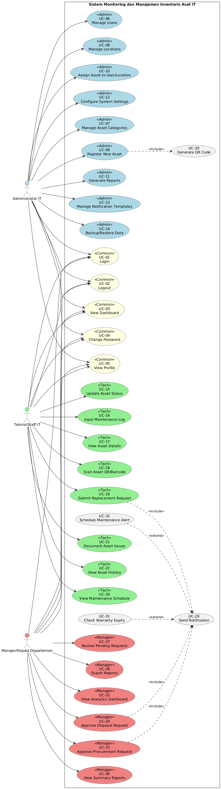

# Rancangan Sistem Monitoring dan Manajemen Inventaris Aset IT Berbasis Web

## 📋 Deskripsi Proyek

Sistem Monitoring dan Manajemen Inventaris Aset IT adalah aplikasi berbasis web yang dirancang untuk membantu organisasi dalam mengelola siklus hidup aset-aset teknologi informasi secara efektif dan efisien. Sistem ini mencakup pencatatan, pemantauan kondisi, pemeliharaan, hingga penghapusan aset IT.

## 🎯 Tujuan Sistem

1. **Pencatatan Aset Terpusat**: Menyimpan seluruh data aset IT (Laptop, Server, Router, dll) dalam satu database terpusat
2. **Monitoring Real-time**: Memantau kondisi dan status aset secara berkala
3. **Manajemen Siklus Hidup**: Mengelola aset dari pengadaan hingga penghapusan
4. **Sistem Notifikasi**: Memberikan alert otomatis untuk garansi dan jadwal pemeliharaan
5. **Alur Persetujuan**: Menyediakan workflow approval untuk pengadaan dan penghapusan aset

## 👥 Aktor Sistem

| Aktor                         | Deskripsi                                                                  |
| ----------------------------- | -------------------------------------------------------------------------- |
| **Administrator IT**          | Mengelola master data aset, konfigurasi sistem, dan akun pengguna          |
| **Teknisi/Staff IT**          | Melakukan update status kondisi aset, input perbaikan, dan verifikasi aset |
| **Manajer/Kepala Departemen** | Memberikan persetujuan pengadaan/penghapusan aset dan melihat laporan      |

## 🖼️ Visualisasi Sistem

Berikut adalah gambaran umum sistem melalui diagram:

### Arsitektur Sistem


### Use Case Diagram Utama



## 📁 Struktur Dokumentasi

| File                                               | Deskripsi                               |
| -------------------------------------------------- | --------------------------------------- |
| [01-actors.md](./01-actors.md)                     | Identifikasi dan deskripsi detail aktor |
| [02-use-case-diagram.md](./02-use-case-diagram.md) | Use Case Diagram dengan PlantUML        |
| [03-sequence-diagram.md](./03-sequence-diagram.md) | Sequence Diagram untuk setiap use case  |
| [04-activity-diagram.md](./04-activity-diagram.md) | Activity Diagram alur proses bisnis     |
| [05-class-diagram.md](./05-class-diagram.md)       | Class Diagram struktur sistem           |
| [06-technology-stack.md](./06-technology-stack.md) | Stack teknologi yang digunakan          |
| [07-database-schema.md](./07-database-schema.md)   | Skema database detail                   |

### Entity Relationship Diagram (ERD)


## 🔄 Alur Kerja Utama

### A. Manajemen Siklus Hidup Aset

```
Registrasi → Penempatan → Monitoring → Pemeliharaan → Penghapusan
```

### B. Monitoring & Alerting

```
Sistem Deteksi → Notifikasi → Tindakan Teknisi → Pembaruan Status
```

### C. Pengajuan & Persetujuan

```
Pengajuan Teknisi → Notifikasi Manajer → Validasi → Update Sistem
```

## 🛠 Teknologi yang Direkomendasikan

- **Backend**: ElysiaJS / Axum (Rust)
- **Frontend**: React/Next.js dengan TailwindCSS
- **Database**: PostgreSQL dengan Prisma ORM
- **Authentication**: JWT-based authentication

## 📊 Fitur Utama

1. ✅ Dashboard Analytics
2. ✅ Manajemen Aset CRUD
3. ✅ QR/Barcode Generator
4. ✅ Sistem Notifikasi Otomatis
5. ✅ Workflow Approval
6. ✅ Laporan & Export
7. ✅ Manajemen Pengguna
8. ✅ Log Maintenance

## 🌐 Remote Access (Tunneling)

Untuk mengakses aplikasi dari internet (misalnya untuk demo atau testing), project ini menggunakan **Ngrok** yang sudah terintegrasi dalam config docker-compose.

### Persiapan

Pastikan Anda memiliki Authtoken dari [dashboard.ngrok.com](https://dashboard.ngrok.com).

### Konfigurasi

Tambahkan token ngrok Anda ke file `.env` di root project:

```bash
NGROK_AUTHTOKEN=your_auth_token_here
```

### Menjalankan Tunnel

Service ngrok akan otomatis berjalan ketika anda menjalankan `docker-compose up`.

Untuk melihat URL publik yang aktif:

1. Buka browser dan akses [http://localhost:4040](http://localhost:4040)
2. Atau cek via CLI:
   ```bash
   curl http://localhost:4040/api/tunnels
   ```

Tunnel yang tersedia:

- **Frontend**: Akses ke UI aplikasi
- **Backend**: Akses ke API server

---

**Author**: IT Asset Management Team  
**Version**: 1.0  
**Last Updated**: Januari 2026
