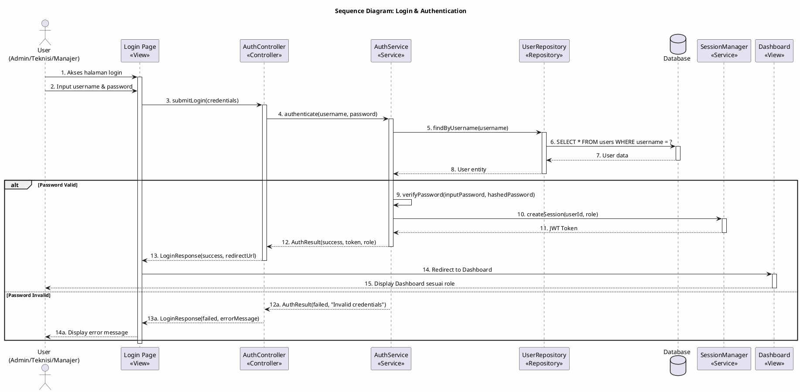
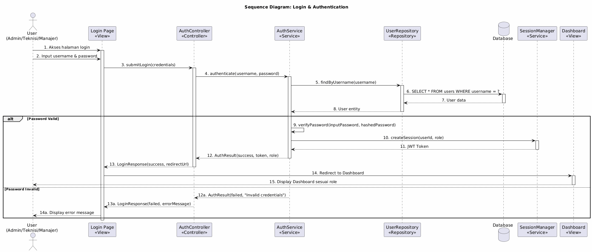

# Sequence Diagram - Login & Authentication

## 📋 Deskripsi

Proses autentikasi pengguna untuk masuk ke sistem. Berlaku untuk semua aktor (Admin, Teknisi, Manajer).

---

```plantuml
@startuml SD_Login
skinparam backgroundColor #FEFEFE
skinparam sequenceMessageAlign center

title Sequence Diagram: Login & Authentication

actor "User\n(Admin/Teknisi/Manajer)" as User
participant "Login Page\n<<View>>" as LoginPage
participant "AuthController\n<<Controller>>" as AuthController
participant "AuthService\n<<Service>>" as AuthService
participant "UserRepository\n<<Repository>>" as UserRepo
database "Database" as DB
participant "SessionManager\n<<Service>>" as Session
participant "Dashboard\n<<View>>" as Dashboard

User -> LoginPage : 1. Akses halaman login
activate LoginPage

User -> LoginPage : 2. Input username & password
LoginPage -> AuthController : 3. submitLogin(credentials)
activate AuthController

AuthController -> AuthService : 4. authenticate(username, password)
activate AuthService

AuthService -> UserRepo : 5. findByUsername(username)
activate UserRepo

UserRepo -> DB : 6. SELECT * FROM users WHERE username = ?
activate DB
DB --> UserRepo : 7. User data
deactivate DB

UserRepo --> AuthService : 8. User entity
deactivate UserRepo

alt Password Valid
    AuthService -> AuthService : 9. verifyPassword(inputPassword, hashedPassword)
    AuthService -> Session : 10. createSession(userId, role)
    activate Session
    Session --> AuthService : 11. JWT Token
    deactivate Session

    AuthService --> AuthController : 12. AuthResult(success, token, role)
    deactivate AuthService

    AuthController --> LoginPage : 13. LoginResponse(success, redirectUrl)
    deactivate AuthController

    LoginPage -> Dashboard : 14. Redirect to Dashboard
    activate Dashboard
    Dashboard --> User : 15. Display Dashboard sesuai role
    deactivate Dashboard

else Password Invalid
    AuthService --> AuthController : 12a. AuthResult(failed, "Invalid credentials")
    AuthController --> LoginPage : 13a. LoginResponse(failed, errorMessage)
    LoginPage --> User : 14a. Display error message
end

deactivate LoginPage

@enduml
```

