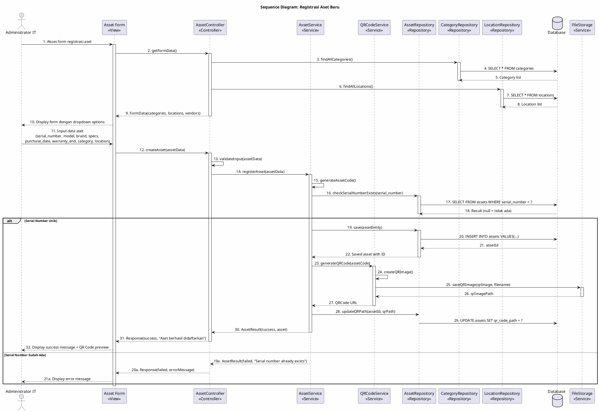
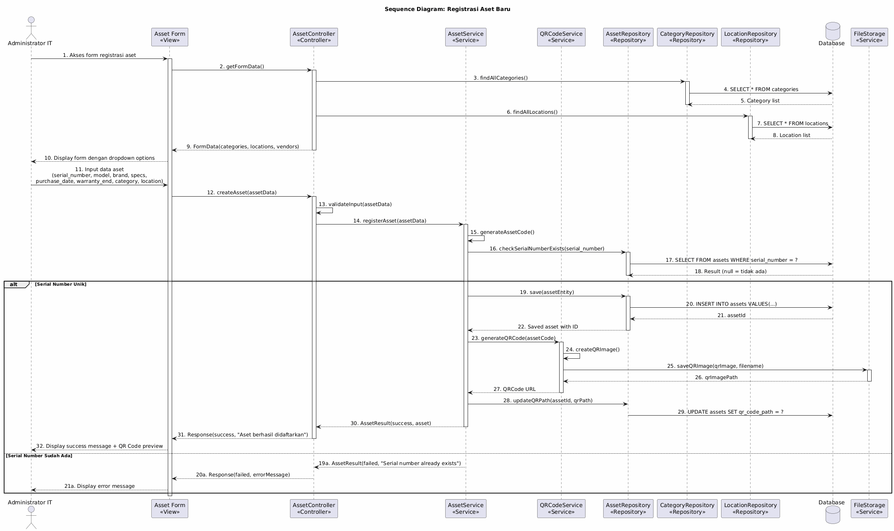

# Sequence Diagram - Registrasi Aset Baru

## 📋 Deskripsi

Proses pendaftaran aset IT baru ke dalam sistem oleh Administrator IT.

---

```plantuml
@startuml SD_Register_Asset
skinparam backgroundColor #FEFEFE
skinparam sequenceMessageAlign center

title Sequence Diagram: Registrasi Aset Baru

actor "Administrator IT" as Admin
participant "Asset Form\n<<View>>" as AssetForm
participant "AssetController\n<<Controller>>" as AssetController
participant "AssetService\n<<Service>>" as AssetService
participant "QRCodeService\n<<Service>>" as QRService
participant "AssetRepository\n<<Repository>>" as AssetRepo
participant "CategoryRepository\n<<Repository>>" as CatRepo
participant "LocationRepository\n<<Repository>>" as LocRepo
database "Database" as DB
participant "FileStorage\n<<Service>>" as Storage

Admin -> AssetForm : 1. Akses form registrasi aset
activate AssetForm

AssetForm -> AssetController : 2. getFormData()
activate AssetController
AssetController -> CatRepo : 3. findAllCategories()
activate CatRepo
CatRepo -> DB : 4. SELECT * FROM categories
DB --> CatRepo : 5. Category list
deactivate CatRepo

AssetController -> LocRepo : 6. findAllLocations()
activate LocRepo
LocRepo -> DB : 7. SELECT * FROM locations
DB --> LocRepo : 8. Location list
deactivate LocRepo

AssetController --> AssetForm : 9. FormData(categories, locations, vendors)
deactivate AssetController

AssetForm --> Admin : 10. Display form dengan dropdown options

Admin -> AssetForm : 11. Input data aset\n(serial_number, model, brand, specs,\npurchase_date, warranty_end, category, location)
AssetForm -> AssetController : 12. createAsset(assetData)
activate AssetController

AssetController -> AssetController : 13. validateInput(assetData)

AssetController -> AssetService : 14. registerAsset(assetData)
activate AssetService

AssetService -> AssetService : 15. generateAssetCode()

AssetService -> AssetRepo : 16. checkSerialNumberExists(serial_number)
activate AssetRepo
AssetRepo -> DB : 17. SELECT FROM assets WHERE serial_number = ?
DB --> AssetRepo : 18. Result (null = tidak ada)
deactivate AssetRepo

alt Serial Number Unik
    AssetService -> AssetRepo : 19. save(assetEntity)
    activate AssetRepo
    AssetRepo -> DB : 20. INSERT INTO assets VALUES(...)
    DB --> AssetRepo : 21. assetId
    AssetRepo --> AssetService : 22. Saved asset with ID
    deactivate AssetRepo

    AssetService -> QRService : 23. generateQRCode(assetCode)
    activate QRService
    QRService -> QRService : 24. createQRImage()
    QRService -> Storage : 25. saveQRImage(qrImage, filename)
    activate Storage
    Storage --> QRService : 26. qrImagePath
    deactivate Storage
    QRService --> AssetService : 27. QRCode URL
    deactivate QRService

    AssetService -> AssetRepo : 28. updateQRPath(assetId, qrPath)
    AssetRepo -> DB : 29. UPDATE assets SET qr_code_path = ?

    AssetService --> AssetController : 30. AssetResult(success, asset)
    deactivate AssetService

    AssetController --> AssetForm : 31. Response(success, "Aset berhasil didaftarkan")
    deactivate AssetController

    AssetForm --> Admin : 32. Display success message + QR Code preview

else Serial Number Sudah Ada
    AssetService --> AssetController : 19a. AssetResult(failed, "Serial number already exists")
    AssetController --> AssetForm : 20a. Response(failed, errorMessage)
    AssetForm --> Admin : 21a. Display error message
end

deactivate AssetForm

@enduml
```

