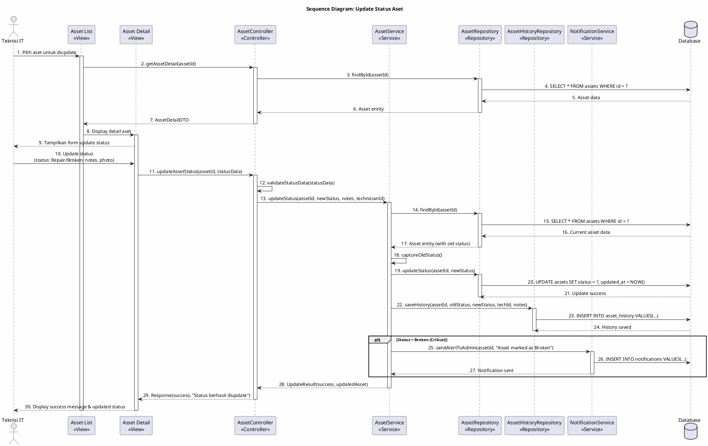
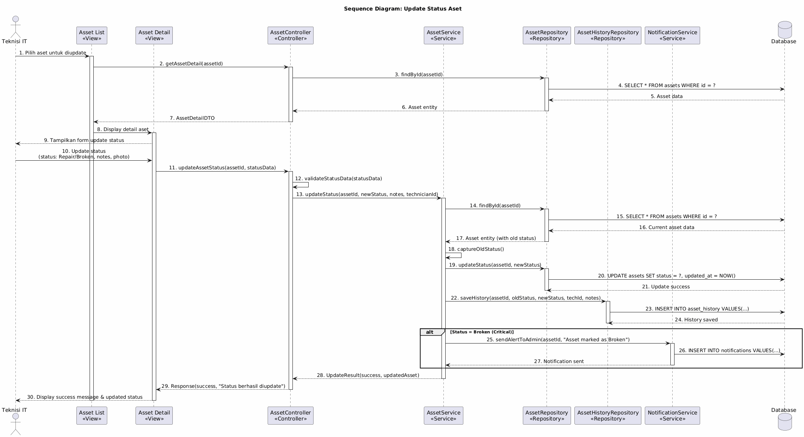

# Sequence Diagram - Update Status Aset

## 📋 Deskripsi

Proses pembaruan status kondisi aset oleh Teknisi IT.

---

```plantuml
@startuml SD_Update_Status
skinparam backgroundColor #FEFEFE
skinparam sequenceMessageAlign center

title Sequence Diagram: Update Status Aset

actor "Teknisi IT" as Tech
participant "Asset List\n<<View>>" as AssetList
participant "Asset Detail\n<<View>>" as AssetDetail
participant "AssetController\n<<Controller>>" as AssetController
participant "AssetService\n<<Service>>" as AssetService
participant "AssetRepository\n<<Repository>>" as AssetRepo
participant "AssetHistoryRepository\n<<Repository>>" as HistoryRepo
participant "NotificationService\n<<Service>>" as NotifService
database "Database" as DB

Tech -> AssetList : 1. Pilih aset untuk diupdate
activate AssetList

AssetList -> AssetController : 2. getAssetDetail(assetId)
activate AssetController
AssetController -> AssetRepo : 3. findById(assetId)
activate AssetRepo
AssetRepo -> DB : 4. SELECT * FROM assets WHERE id = ?
DB --> AssetRepo : 5. Asset data
AssetRepo --> AssetController : 6. Asset entity
deactivate AssetRepo
AssetController --> AssetList : 7. AssetDetailDTO
deactivate AssetController

AssetList -> AssetDetail : 8. Display detail aset
activate AssetDetail
AssetDetail --> Tech : 9. Tampilkan form update status

Tech -> AssetDetail : 10. Update status\n(status: Repair/Broken, notes, photo)

AssetDetail -> AssetController : 11. updateAssetStatus(assetId, statusData)
activate AssetController

AssetController -> AssetController : 12. validateStatusData(statusData)

AssetController -> AssetService : 13. updateStatus(assetId, newStatus, notes, technicianId)
activate AssetService

AssetService -> AssetRepo : 14. findById(assetId)
activate AssetRepo
AssetRepo -> DB : 15. SELECT * FROM assets WHERE id = ?
DB --> AssetRepo : 16. Current asset data
AssetRepo --> AssetService : 17. Asset entity (with old status)
deactivate AssetRepo

AssetService -> AssetService : 18. captureOldStatus()

AssetService -> AssetRepo : 19. updateStatus(assetId, newStatus)
activate AssetRepo
AssetRepo -> DB : 20. UPDATE assets SET status = ?, updated_at = NOW()
DB --> AssetRepo : 21. Update success
deactivate AssetRepo

AssetService -> HistoryRepo : 22. saveHistory(assetId, oldStatus, newStatus, techId, notes)
activate HistoryRepo
HistoryRepo -> DB : 23. INSERT INTO asset_history VALUES(...)
DB --> HistoryRepo : 24. History saved
deactivate HistoryRepo

alt Status = Broken (Critical)
    AssetService -> NotifService : 25. sendAlertToAdmin(assetId, "Asset marked as Broken")
    activate NotifService
    NotifService -> DB : 26. INSERT INTO notifications VALUES(...)
    NotifService --> AssetService : 27. Notification sent
    deactivate NotifService
end

AssetService --> AssetController : 28. UpdateResult(success, updatedAsset)
deactivate AssetService

AssetController --> AssetDetail : 29. Response(success, "Status berhasil diupdate")
deactivate AssetController

AssetDetail --> Tech : 30. Display success message & updated status
deactivate AssetDetail
deactivate AssetList

@enduml
```

