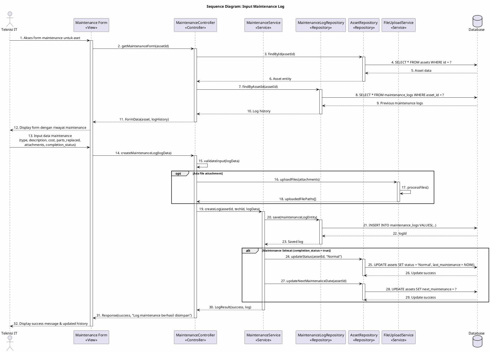
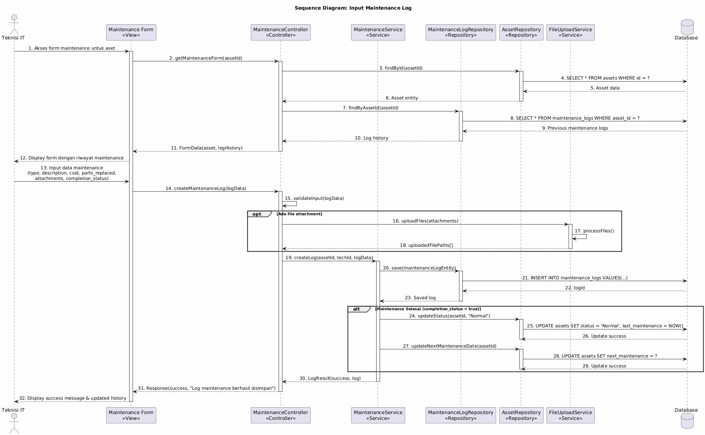

# Sequence Diagram - Input Maintenance Log

## 📋 Deskripsi

Proses pencatatan log pemeliharaan/perbaikan aset oleh Teknisi IT.

---

```plantuml
@startuml SD_Maintenance_Log
skinparam backgroundColor #FEFEFE
skinparam sequenceMessageAlign center

title Sequence Diagram: Input Maintenance Log

actor "Teknisi IT" as Tech
participant "Maintenance Form\n<<View>>" as MaintenanceForm
participant "MaintenanceController\n<<Controller>>" as MaintenanceController
participant "MaintenanceService\n<<Service>>" as MaintenanceService
participant "MaintenanceLogRepository\n<<Repository>>" as LogRepo
participant "AssetRepository\n<<Repository>>" as AssetRepo
participant "FileUploadService\n<<Service>>" as UploadService
database "Database" as DB

Tech -> MaintenanceForm : 1. Akses form maintenance untuk aset
activate MaintenanceForm

MaintenanceForm -> MaintenanceController : 2. getMaintenanceForm(assetId)
activate MaintenanceController
MaintenanceController -> AssetRepo : 3. findById(assetId)
activate AssetRepo
AssetRepo -> DB : 4. SELECT * FROM assets WHERE id = ?
DB --> AssetRepo : 5. Asset data
AssetRepo --> MaintenanceController : 6. Asset entity
deactivate AssetRepo

MaintenanceController -> LogRepo : 7. findByAssetId(assetId)
activate LogRepo
LogRepo -> DB : 8. SELECT * FROM maintenance_logs WHERE asset_id = ?
DB --> LogRepo : 9. Previous maintenance logs
LogRepo --> MaintenanceController : 10. Log history
deactivate LogRepo

MaintenanceController --> MaintenanceForm : 11. FormData(asset, logHistory)
deactivate MaintenanceController

MaintenanceForm --> Tech : 12. Display form dengan riwayat maintenance

Tech -> MaintenanceForm : 13. Input data maintenance\n(type, description, cost, parts_replaced,\nattachments, completion_status)

MaintenanceForm -> MaintenanceController : 14. createMaintenanceLog(logData)
activate MaintenanceController

MaintenanceController -> MaintenanceController : 15. validateInput(logData)

opt Ada file attachment
    MaintenanceController -> UploadService : 16. uploadFiles(attachments)
    activate UploadService
    UploadService -> UploadService : 17. processFiles()
    UploadService --> MaintenanceController : 18. uploadedFilePaths[]
    deactivate UploadService
end

MaintenanceController -> MaintenanceService : 19. createLog(assetId, techId, logData)
activate MaintenanceService

MaintenanceService -> LogRepo : 20. save(maintenanceLogEntity)
activate LogRepo
LogRepo -> DB : 21. INSERT INTO maintenance_logs VALUES(...)
DB --> LogRepo : 22. logId
LogRepo --> MaintenanceService : 23. Saved log
deactivate LogRepo

alt Maintenance Selesai (completion_status = true)
    MaintenanceService -> AssetRepo : 24. updateStatus(assetId, "Normal")
    activate AssetRepo
    AssetRepo -> DB : 25. UPDATE assets SET status = 'Normal', last_maintenance = NOW()
    DB --> AssetRepo : 26. Update success
    deactivate AssetRepo

    MaintenanceService -> AssetRepo : 27. updateNextMaintenanceDate(assetId)
    activate AssetRepo
    AssetRepo -> DB : 28. UPDATE assets SET next_maintenance = ?
    DB --> AssetRepo : 29. Update success
    deactivate AssetRepo
end

MaintenanceService --> MaintenanceController : 30. LogResult(success, log)
deactivate MaintenanceService

MaintenanceController --> MaintenanceForm : 31. Response(success, "Log maintenance berhasil disimpan")
deactivate MaintenanceController

MaintenanceForm --> Tech : 32. Display success message & updated history
deactivate MaintenanceForm

@enduml
```

