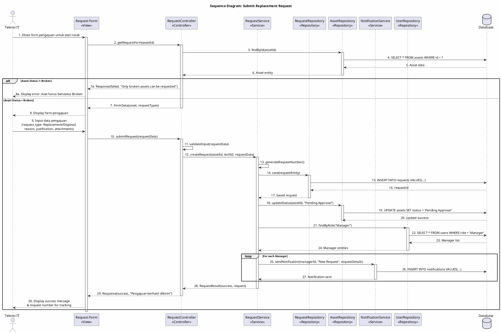
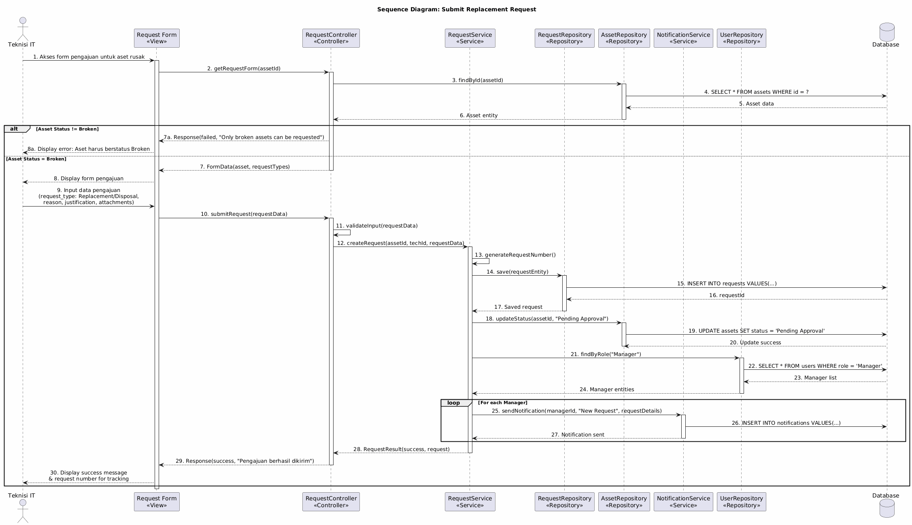

# Sequence Diagram - Submit Replacement Request

## 📋 Deskripsi

Proses pengajuan penggantian/penghapusan aset rusak oleh Teknisi IT.

---

```plantuml
@startuml SD_Submit_Request
skinparam backgroundColor #FEFEFE
skinparam sequenceMessageAlign center

title Sequence Diagram: Submit Replacement Request

actor "Teknisi IT" as Tech
participant "Request Form\n<<View>>" as RequestForm
participant "RequestController\n<<Controller>>" as RequestController
participant "RequestService\n<<Service>>" as RequestService
participant "RequestRepository\n<<Repository>>" as RequestRepo
participant "AssetRepository\n<<Repository>>" as AssetRepo
participant "NotificationService\n<<Service>>" as NotifService
participant "UserRepository\n<<Repository>>" as UserRepo
database "Database" as DB

Tech -> RequestForm : 1. Akses form pengajuan untuk aset rusak
activate RequestForm

RequestForm -> RequestController : 2. getRequestForm(assetId)
activate RequestController
RequestController -> AssetRepo : 3. findById(assetId)
activate AssetRepo
AssetRepo -> DB : 4. SELECT * FROM assets WHERE id = ?
DB --> AssetRepo : 5. Asset data
AssetRepo --> RequestController : 6. Asset entity
deactivate AssetRepo

alt Asset Status != Broken
    RequestController --> RequestForm : 7a. Response(failed, "Only broken assets can be requested")
    RequestForm --> Tech : 8a. Display error: Aset harus berstatus Broken
else Asset Status = Broken
    RequestController --> RequestForm : 7. FormData(asset, requestTypes)
    deactivate RequestController
    RequestForm --> Tech : 8. Display form pengajuan

    Tech -> RequestForm : 9. Input data pengajuan\n(request_type: Replacement/Disposal,\nreason, justification, attachments)

    RequestForm -> RequestController : 10. submitRequest(requestData)
    activate RequestController

    RequestController -> RequestController : 11. validateInput(requestData)

    RequestController -> RequestService : 12. createRequest(assetId, techId, requestData)
    activate RequestService

    RequestService -> RequestService : 13. generateRequestNumber()

    RequestService -> RequestRepo : 14. save(requestEntity)
    activate RequestRepo
    RequestRepo -> DB : 15. INSERT INTO requests VALUES(...)
    DB --> RequestRepo : 16. requestId
    RequestRepo --> RequestService : 17. Saved request
    deactivate RequestRepo

    RequestService -> AssetRepo : 18. updateStatus(assetId, "Pending Approval")
    activate AssetRepo
    AssetRepo -> DB : 19. UPDATE assets SET status = 'Pending Approval'
    DB --> AssetRepo : 20. Update success
    deactivate AssetRepo

    RequestService -> UserRepo : 21. findByRole("Manager")
    activate UserRepo
    UserRepo -> DB : 22. SELECT * FROM users WHERE role = 'Manager'
    DB --> UserRepo : 23. Manager list
    UserRepo --> RequestService : 24. Manager entities
    deactivate UserRepo

    loop For each Manager
        RequestService -> NotifService : 25. sendNotification(managerId, "New Request", requestDetails)
        activate NotifService
        NotifService -> DB : 26. INSERT INTO notifications VALUES(...)
        NotifService --> RequestService : 27. Notification sent
        deactivate NotifService
    end

    RequestService --> RequestController : 28. RequestResult(success, request)
    deactivate RequestService

    RequestController --> RequestForm : 29. Response(success, "Pengajuan berhasil dikirim")
    deactivate RequestController

    RequestForm --> Tech : 30. Display success message\n& request number for tracking
end

deactivate RequestForm

@enduml
```

