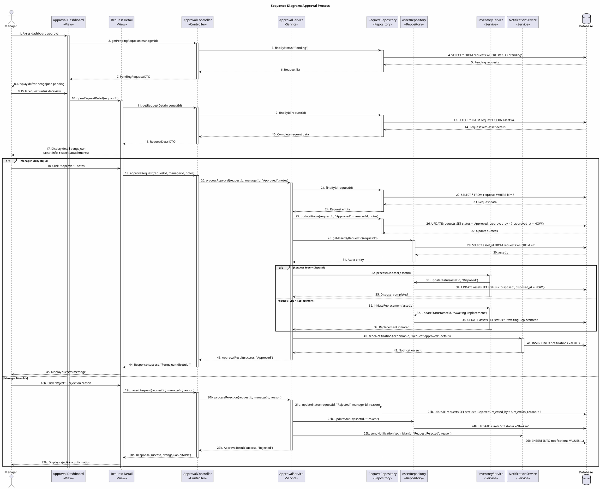
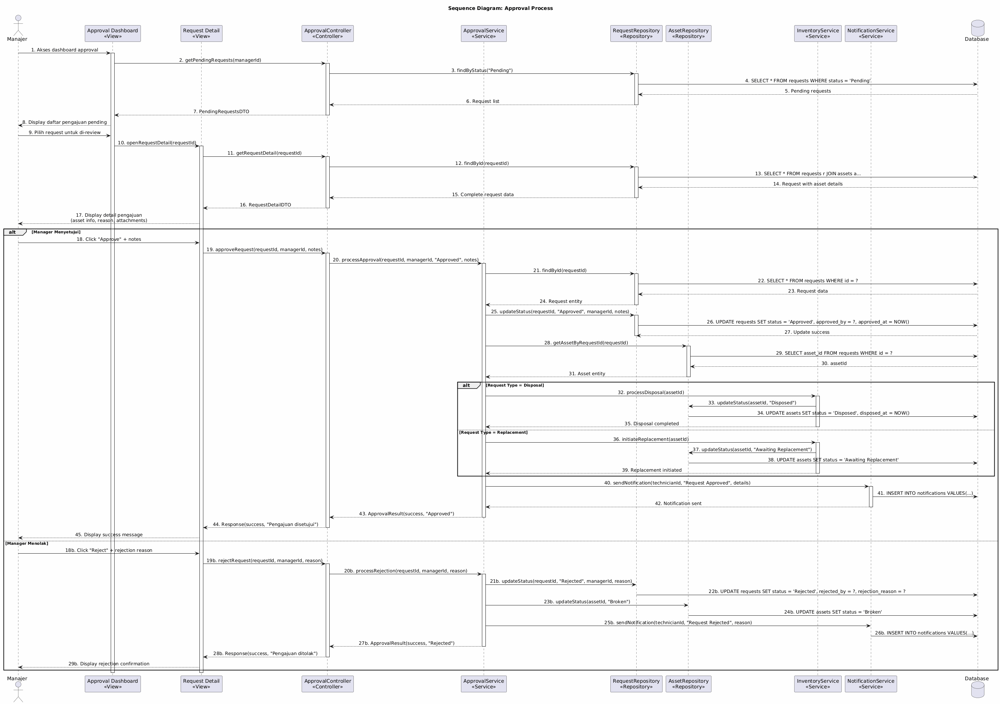

# Sequence Diagram - Approval Process

## 📋 Deskripsi

Proses validasi dan persetujuan/penolakan pengajuan oleh Manajer.

---

```plantuml
@startuml SD_Approval_Process
skinparam backgroundColor #FEFEFE
skinparam sequenceMessageAlign center

title Sequence Diagram: Approval Process

actor "Manajer" as Manager
participant "Approval Dashboard\n<<View>>" as Dashboard
participant "Request Detail\n<<View>>" as RequestDetail
participant "ApprovalController\n<<Controller>>" as ApprovalController
participant "ApprovalService\n<<Service>>" as ApprovalService
participant "RequestRepository\n<<Repository>>" as RequestRepo
participant "AssetRepository\n<<Repository>>" as AssetRepo
participant "InventoryService\n<<Service>>" as InventoryService
participant "NotificationService\n<<Service>>" as NotifService
database "Database" as DB

Manager -> Dashboard : 1. Akses dashboard approval
activate Dashboard

Dashboard -> ApprovalController : 2. getPendingRequests(managerId)
activate ApprovalController
ApprovalController -> RequestRepo : 3. findByStatus("Pending")
activate RequestRepo
RequestRepo -> DB : 4. SELECT * FROM requests WHERE status = 'Pending'
DB --> RequestRepo : 5. Pending requests
RequestRepo --> ApprovalController : 6. Request list
deactivate RequestRepo

ApprovalController --> Dashboard : 7. PendingRequestsDTO
deactivate ApprovalController

Dashboard --> Manager : 8. Display daftar pengajuan pending

Manager -> Dashboard : 9. Pilih request untuk di-review
Dashboard -> RequestDetail : 10. openRequestDetail(requestId)
activate RequestDetail

RequestDetail -> ApprovalController : 11. getRequestDetail(requestId)
activate ApprovalController
ApprovalController -> RequestRepo : 12. findById(requestId)
activate RequestRepo
RequestRepo -> DB : 13. SELECT * FROM requests r JOIN assets a...
DB --> RequestRepo : 14. Request with asset details
RequestRepo --> ApprovalController : 15. Complete request data
deactivate RequestRepo
ApprovalController --> RequestDetail : 16. RequestDetailDTO
deactivate ApprovalController

RequestDetail --> Manager : 17. Display detail pengajuan\n(asset info, reason, attachments)

alt Manager Menyetujui
    Manager -> RequestDetail : 18. Click "Approve" + notes
    RequestDetail -> ApprovalController : 19. approveRequest(requestId, managerId, notes)
    activate ApprovalController

    ApprovalController -> ApprovalService : 20. processApproval(requestId, managerId, "Approved", notes)
    activate ApprovalService

    ApprovalService -> RequestRepo : 21. findById(requestId)
    activate RequestRepo
    RequestRepo -> DB : 22. SELECT * FROM requests WHERE id = ?
    DB --> RequestRepo : 23. Request data
    RequestRepo --> ApprovalService : 24. Request entity
    deactivate RequestRepo

    ApprovalService -> RequestRepo : 25. updateStatus(requestId, "Approved", managerId, notes)
    activate RequestRepo
    RequestRepo -> DB : 26. UPDATE requests SET status = 'Approved', approved_by = ?, approved_at = NOW()
    DB --> RequestRepo : 27. Update success
    deactivate RequestRepo

    ApprovalService -> AssetRepo : 28. getAssetByRequestId(requestId)
    activate AssetRepo
    AssetRepo -> DB : 29. SELECT asset_id FROM requests WHERE id = ?
    DB --> AssetRepo : 30. assetId
    AssetRepo --> ApprovalService : 31. Asset entity
    deactivate AssetRepo

    alt Request Type = Disposal
        ApprovalService -> InventoryService : 32. processDisposal(assetId)
        activate InventoryService
        InventoryService -> AssetRepo : 33. updateStatus(assetId, "Disposed")
        AssetRepo -> DB : 34. UPDATE assets SET status = 'Disposed', disposed_at = NOW()
        InventoryService --> ApprovalService : 35. Disposal completed
        deactivate InventoryService
    else Request Type = Replacement
        ApprovalService -> InventoryService : 36. initiateReplacement(assetId)
        activate InventoryService
        InventoryService -> AssetRepo : 37. updateStatus(assetId, "Awaiting Replacement")
        AssetRepo -> DB : 38. UPDATE assets SET status = 'Awaiting Replacement'
        InventoryService --> ApprovalService : 39. Replacement initiated
        deactivate InventoryService
    end

    ApprovalService -> NotifService : 40. sendNotification(technicianId, "Request Approved", details)
    activate NotifService
    NotifService -> DB : 41. INSERT INTO notifications VALUES(...)
    NotifService --> ApprovalService : 42. Notification sent
    deactivate NotifService

    ApprovalService --> ApprovalController : 43. ApprovalResult(success, "Approved")
    deactivate ApprovalService

    ApprovalController --> RequestDetail : 44. Response(success, "Pengajuan disetujui")
    deactivate ApprovalController

    RequestDetail --> Manager : 45. Display success message

else Manager Menolak
    Manager -> RequestDetail : 18b. Click "Reject" + rejection reason
    RequestDetail -> ApprovalController : 19b. rejectRequest(requestId, managerId, reason)
    activate ApprovalController

    ApprovalController -> ApprovalService : 20b. processRejection(requestId, managerId, reason)
    activate ApprovalService

    ApprovalService -> RequestRepo : 21b. updateStatus(requestId, "Rejected", managerId, reason)
    RequestRepo -> DB : 22b. UPDATE requests SET status = 'Rejected', rejected_by = ?, rejection_reason = ?

    ApprovalService -> AssetRepo : 23b. updateStatus(assetId, "Broken")
    AssetRepo -> DB : 24b. UPDATE assets SET status = 'Broken'

    ApprovalService -> NotifService : 25b. sendNotification(technicianId, "Request Rejected", reason)
    NotifService -> DB : 26b. INSERT INTO notifications VALUES(...)

    ApprovalService --> ApprovalController : 27b. ApprovalResult(success, "Rejected")
    deactivate ApprovalService

    ApprovalController --> RequestDetail : 28b. Response(success, "Pengajuan ditolak")
    deactivate ApprovalController

    RequestDetail --> Manager : 29b. Display rejection confirmation
end

deactivate RequestDetail
deactivate Dashboard

@enduml
```

