# Use Case Diagram - Overview

## 📋 Deskripsi

Use Case Diagram Utama menggambarkan interaksi antara aktor-aktor dengan sistem Monitoring dan Manajemen Inventaris Aset IT. Diagram ini menunjukkan fungsionalitas sistem dari perspektif pengguna.

---

## Use Case Diagram Utama

```plantuml
@startuml Use_Case_Diagram_Main
skinparam backgroundColor #FEFEFE
skinparam usecase {
    BackgroundColor<<Admin>> LightBlue
    BackgroundColor<<Tech>> LightGreen
    BackgroundColor<<Manager>> LightCoral
    BackgroundColor<<Common>> LightYellow
}

left to right direction

actor "Administrator IT" as Admin #LightBlue
actor "Teknisi/Staff IT" as Tech #LightGreen
actor "Manajer/Kepala Departemen" as Manager #LightCoral

rectangle "Sistem Monitoring dan Manajemen Inventaris Aset IT" {

    ' Common Use Cases
    usecase "UC-01\nLogin" as UC01 <<Common>>
    usecase "UC-02\nLogout" as UC02 <<Common>>
    usecase "UC-03\nView Dashboard" as UC03 <<Common>>
    usecase "UC-04\nChange Password" as UC04 <<Common>>
    usecase "UC-05\nView Profile" as UC05 <<Common>>

    ' Admin Use Cases
    usecase "UC-06\nManage Users" as UC06 <<Admin>>
    usecase "UC-07\nManage Asset Categories" as UC07 <<Admin>>
    usecase "UC-08\nManage Locations" as UC08 <<Admin>>
    usecase "UC-09\nRegister New Asset" as UC09 <<Admin>>
    usecase "UC-10\nAssign Asset to User/Location" as UC10 <<Admin>>
    usecase "UC-11\nGenerate Reports" as UC11 <<Admin>>
    usecase "UC-12\nConfigure System Settings" as UC12 <<Admin>>
    usecase "UC-13\nManage Notification Templates" as UC13 <<Admin>>
    usecase "UC-14\nBackup/Restore Data" as UC14 <<Admin>>

    ' Technician Use Cases
    usecase "UC-15\nUpdate Asset Status" as UC15 <<Tech>>
    usecase "UC-16\nInput Maintenance Log" as UC16 <<Tech>>
    usecase "UC-17\nView Asset Details" as UC17 <<Tech>>
    usecase "UC-18\nScan Asset QR/Barcode" as UC18 <<Tech>>
    usecase "UC-19\nSubmit Replacement Request" as UC19 <<Tech>>
    usecase "UC-20\nView Maintenance Schedule" as UC20 <<Tech>>
    usecase "UC-21\nDocument Asset Issues" as UC21 <<Tech>>
    usecase "UC-22\nView Asset History" as UC22 <<Tech>>

    ' Manager Use Cases
    usecase "UC-23\nApprove Procurement Request" as UC23 <<Manager>>
    usecase "UC-24\nApprove Disposal Request" as UC24 <<Manager>>
    usecase "UC-25\nView Analytics Dashboard" as UC25 <<Manager>>
    usecase "UC-26\nView Summary Reports" as UC26 <<Manager>>
    usecase "UC-27\nReview Pending Requests" as UC27 <<Manager>>
    usecase "UC-28\nExport Reports" as UC28 <<Manager>>

    ' System Use Cases
    usecase "UC-29\nSend Notification" as UC29
    usecase "UC-30\nGenerate QR Code" as UC30
    usecase "UC-31\nCheck Warranty Expiry" as UC31
    usecase "UC-32\nSchedule Maintenance Alert" as UC32
}

' Common connections
Admin --> UC01
Admin --> UC02
Admin --> UC03
Admin --> UC04
Admin --> UC05

Tech --> UC01
Tech --> UC02
Tech --> UC03
Tech --> UC04
Tech --> UC05

Manager --> UC01
Manager --> UC02
Manager --> UC03
Manager --> UC04
Manager --> UC05

' Admin connections
Admin --> UC06
Admin --> UC07
Admin --> UC08
Admin --> UC09
Admin --> UC10
Admin --> UC11
Admin --> UC12
Admin --> UC13
Admin --> UC14

' Technician connections
Tech --> UC15
Tech --> UC16
Tech --> UC17
Tech --> UC18
Tech --> UC19
Tech --> UC20
Tech --> UC21
Tech --> UC22

' Manager connections
Manager --> UC23
Manager --> UC24
Manager --> UC25
Manager --> UC26
Manager --> UC27
Manager --> UC28

' Include relationships
UC09 ..> UC30 : <<include>>
UC19 ..> UC29 : <<include>>
UC23 ..> UC29 : <<include>>
UC24 ..> UC29 : <<include>>

' Extend relationships
UC31 ..> UC29 : <<extend>>
UC32 ..> UC29 : <<extend>>

@enduml
```

---

## Deskripsi Use Cases

### Use Cases Umum (Semua Aktor)

| ID    | Use Case        | Deskripsi                                          | Pre-condition       | Post-condition                  |
| ----- | --------------- | -------------------------------------------------- | ------------------- | ------------------------------- |
| UC-01 | Login           | Aktor memasukkan kredensial untuk mengakses sistem | Memiliki akun aktif | Berhasil login, session dimulai |
| UC-02 | Logout          | Aktor keluar dari sistem                           | Sudah login         | Session berakhir                |
| UC-03 | View Dashboard  | Melihat halaman utama sesuai role                  | Sudah login         | Dashboard ditampilkan           |
| UC-04 | Change Password | Mengubah password akun                             | Sudah login         | Password diperbarui             |
| UC-05 | View Profile    | Melihat informasi akun pribadi                     | Sudah login         | Profil ditampilkan              |

---

### Use Cases Administrator IT

| ID    | Use Case                      | Deskripsi                       | Pre-condition       | Post-condition                |
| ----- | ----------------------------- | ------------------------------- | ------------------- | ----------------------------- |
| UC-06 | Manage Users                  | CRUD pengguna sistem            | Login sebagai Admin | Data user tersimpan           |
| UC-07 | Manage Asset Categories       | Mengelola kategori aset         | Login sebagai Admin | Kategori tersimpan            |
| UC-08 | Manage Locations              | Mengelola data lokasi           | Login sebagai Admin | Lokasi tersimpan              |
| UC-09 | Register New Asset            | Mendaftarkan aset baru          | Login sebagai Admin | Aset terdaftar dengan QR Code |
| UC-10 | Assign Asset                  | Menempatkan aset ke user/lokasi | Aset terdaftar      | Penempatan tercatat           |
| UC-11 | Generate Reports              | Membuat laporan                 | Login sebagai Admin | Laporan dihasilkan            |
| UC-12 | Configure Settings            | Konfigurasi parameter sistem    | Login sebagai Admin | Setting tersimpan             |
| UC-13 | Manage Notification Templates | Mengelola template notifikasi   | Login sebagai Admin | Template tersimpan            |
| UC-14 | Backup/Restore Data           | Backup dan restore database     | Login sebagai Admin | Data ter-backup/restored      |

---

### Use Cases Teknisi/Staff IT

| ID    | Use Case                   | Deskripsi                         | Pre-condition                   | Post-condition              |
| ----- | -------------------------- | --------------------------------- | ------------------------------- | --------------------------- |
| UC-15 | Update Asset Status        | Memperbarui status kondisi aset   | Login sebagai Teknisi, Aset ada | Status diperbarui           |
| UC-16 | Input Maintenance Log      | Mencatat log pemeliharaan         | Login sebagai Teknisi           | Log tersimpan               |
| UC-17 | View Asset Details         | Melihat detail informasi aset     | Login sebagai Teknisi           | Detail ditampilkan          |
| UC-18 | Scan Asset QR/Barcode      | Scan kode untuk identifikasi aset | Login sebagai Teknisi           | Aset teridentifikasi        |
| UC-19 | Submit Replacement Request | Mengajukan penggantian aset       | Status aset = Broken            | Request terkirim ke Manajer |
| UC-20 | View Maintenance Schedule  | Melihat jadwal maintenance        | Login sebagai Teknisi           | Jadwal ditampilkan          |
| UC-21 | Document Asset Issues      | Dokumentasi masalah aset          | Login sebagai Teknisi           | Dokumentasi tersimpan       |
| UC-22 | View Asset History         | Melihat riwayat aset              | Login sebagai Teknisi           | History ditampilkan         |

---

### Use Cases Manajer/Kepala Departemen

| ID    | Use Case                    | Deskripsi                      | Pre-condition         | Post-condition                         |
| ----- | --------------------------- | ------------------------------ | --------------------- | -------------------------------------- |
| UC-23 | Approve Procurement Request | Menyetujui pengajuan pengadaan | Ada request pending   | Request approved, notifikasi terkirim  |
| UC-24 | Approve Disposal Request    | Menyetujui penghapusan aset    | Ada request pending   | Request approved, status aset diupdate |
| UC-25 | View Analytics Dashboard    | Melihat dashboard analytics    | Login sebagai Manajer | Dashboard ditampilkan                  |
| UC-26 | View Summary Reports        | Melihat laporan ringkasan      | Login sebagai Manajer | Laporan ditampilkan                    |
| UC-27 | Review Pending Requests     | Meninjau request yang pending  | Login sebagai Manajer | Daftar request ditampilkan             |
| UC-28 | Export Reports              | Export laporan ke PDF/Excel    | Laporan tersedia      | File ter-download                      |

---

## Relationship Antar Use Cases

### Include Relationships

- **Register New Asset** `<<include>>` **Generate QR Code**: Setiap aset baru otomatis dibuatkan QR Code
- **Submit Replacement Request** `<<include>>` **Send Notification**: Request otomatis mengirim notifikasi ke Manajer
- **Approve/Reject Request** `<<include>>` **Send Notification**: Hasil approval otomatis dikirim ke pemohon

### Extend Relationships

- **Check Warranty Expiry** `<<extend>>` **Send Notification**: Jika garansi hampir habis, notifikasi dikirim
- **Schedule Maintenance Alert** `<<extend>>` **Send Notification**: Jika jadwal maintenance tiba, alert dikirim
- **Update to Broken** `<<extend>>` **Submit Replacement Request**: Status broken dapat dilanjutkan ke pengajuan penggantian
