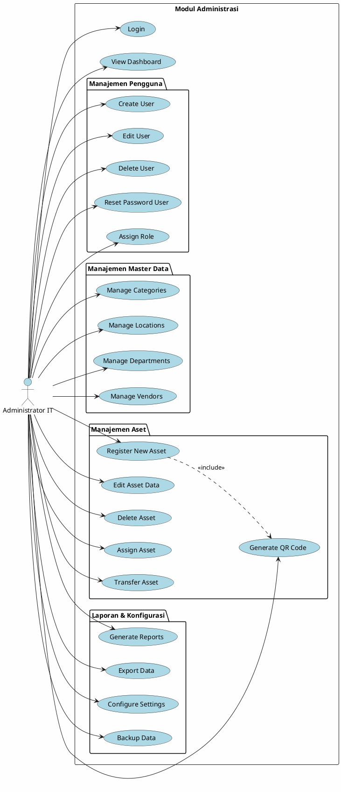
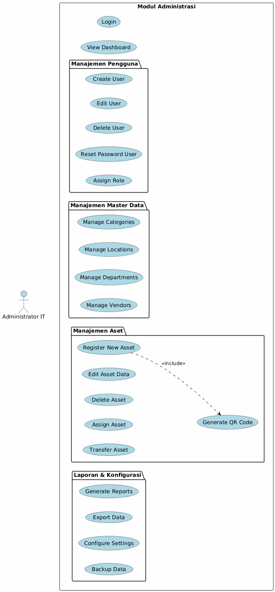

# Use Case Diagram - Administrator IT

## 📋 Deskripsi

Use Case Diagram khusus untuk Administrator IT yang menunjukkan semua fungsionalitas manajemen yang dapat dilakukan oleh administrator.

---

## Use Cases Administrator IT

