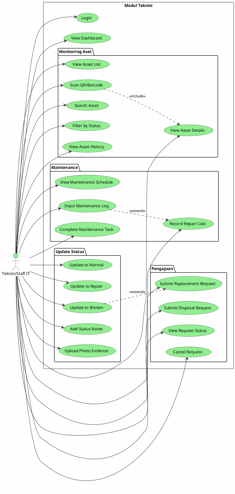

# Use Case Diagram - Teknisi/Staff IT

## 📋 Deskripsi

Use Case Diagram khusus untuk Teknisi/Staff IT yang menunjukkan semua fungsionalitas yang dapat dilakukan untuk monitoring dan perbaikan aset.

---

## Use Cases Teknisi/Staff IT

