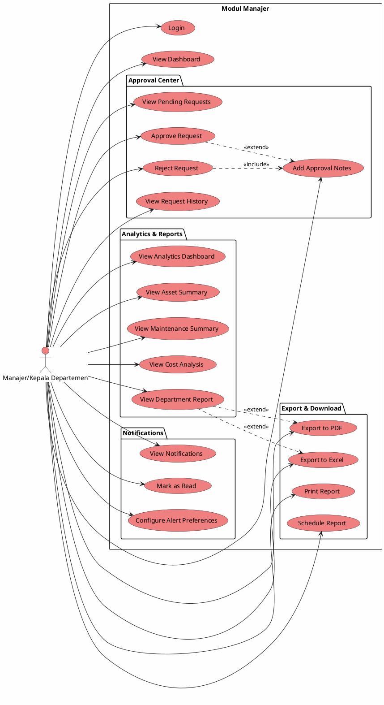

# Use Case Diagram - Manajer/Kepala Departemen

## 📋 Deskripsi

Use Case Diagram khusus untuk Manajer/Kepala Departemen yang menunjukkan semua fungsionalitas approval, analytics, dan reporting.

---

## Use Cases Manajer/Kepala Departemen

